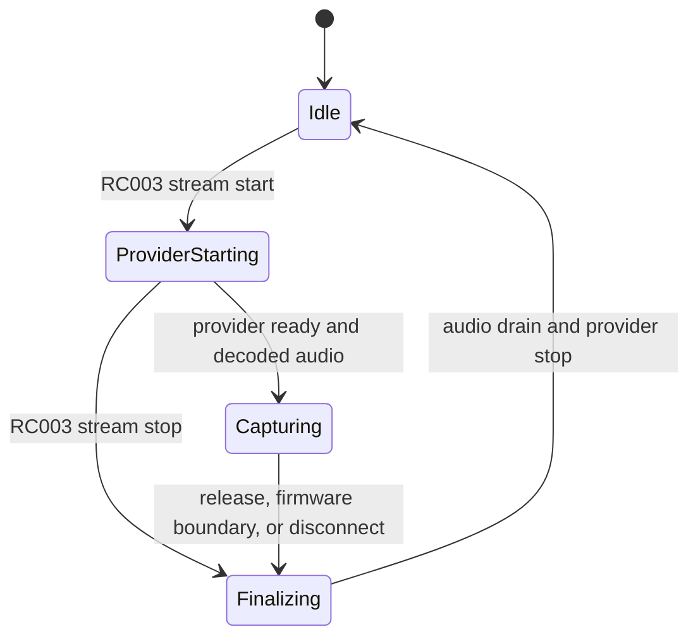

# Vibe Flow Remote v1.5 Architecture

V1.5 keeps the validated V1.2.1 voice core frozen while extending the non-voice configuration and action-routing layers.

## Scope

Vibe Flow is a local Windows bridge for the Xiaomi RC003 / MI RC remote. It does not perform speech recognition. It forwards decoded Bluetooth ATVV audio to a virtual microphone and controls a user-selected local dictation provider.

```text
RC003 keyboard report
  -> VoxDeckInputBridge.exe
  -> named hold/release events

RC003 ATVV BLE audio
  -> VibeMicAtvvCapture.exe
  -> ordered ADPCM decode
  -> speech leveler
  -> 16 kHz mono to 48 kHz stereo
  -> CABLE Input / CABLE Output
  -> dictation provider
  -> focused editable text field

VibeMic.exe
  -> configuration, UI, onboarding, self-check, recovery, logs
```

## Processes

### `VibeMic.exe`

- Owns schema `32` configuration and migration.
- Defaults to the light theme; supports explicit light, dark, and Windows-following preferences.
- Starts one capture process and one input bridge from the same installation root.
- Displays recording only after an `AUDIO LIVE START` event backed by decoded samples.
- Owns manual shortcut Profiles, the physical keyboard shortcut recorder, Smart Profile application bindings, and real action receipts.
- Writes a normalized schema-7 bridge document as the single runtime source for non-voice actions.
- Rotates logs and exports redacted diagnostics.

### `VoxDeckInputBridge.exe`

- Registers low-level keyboard and Raw Input listeners.
- Treats F5 as the RC003 Record key and deduplicates physical DOWN/UP edges.
- Maintains the manual-reset held event and an exactly-once release event.
- Resolves only the verified controls: Record, Function, Center, Home, TV, and four directions.
- Executes normalized application, URL, editing, system, media, screenshot, and keyboard-shortcut actions.
- Optionally selects a shortcut Profile from the foreground process, with explicit fallback, lock, and debounce behavior.
- Opens persistent Windows Task View with `Win + Tab`; direction input is intercepted only while that view is active.
- Recovers the hook and Raw Input registration after HID reconnect.

### `VibeMicAtvvCapture.exe`

- Uses the exact `v1.0.3` recording kernel, with only V1.2.1 heartbeat, cue, and version compatibility hooks.
- Connects to the RC003 ATVV service and subscribes to control/audio characteristics.
- Reassembles ordered ADPCM frames and rejects stale generations.
- Lets the RC003 natural ATVV stream-start and stream-stop controls own the recording lifetime.
- Coalesces duplicate fallback voice requests and ignores duplicate or stale stream transitions.
- Buffers decoded audio until the selected provider reports ready.
- Restores the original Windows capture endpoints after finalization or failure.

## Stable hold state machine



Rules:

- The input bridge deduplicates physical DOWN/UP edges before signaling the capture process.
- Only one capture process can own the named mutex.
- Only one stream generation can be active; duplicate starts and stale stops are ignored.
- Provider start and completion remain ordered by stream generation.
- The capture binary contains no physical-segment continuation, `MIC_EXTEND`, or long-dictation controller.
- The current stable RC003 session ends at approximately 60 seconds if the firmware reports UP or closes the stream first.

## Provider control

WeChat uses the original `v1.0.3` `WeTypeVoiceSessionController`. It attempts the known WeChat toolbar first and uses the configured `Ctrl + Win` shortcut as fallback. The selected provider delivers text to the currently focused input field, so the user must focus that field before holding Record.

Other providers use their configured global shortcut and trigger mode. Vibe Flow does not inspect transcript text, own a transcript buffer, read the clipboard, or synthesize paste.

## Audio profile

| Setting | Locked value |
| --- | --- |
| Stable profile | `v11` |
| Gain | `1.0` |
| Processing | `speech` |
| Drain | `180 ms` |
| Playback endpoint | `CABLE Input` |
| Provider capture endpoint | `CABLE Output` |
| WeChat shortcut | `Ctrl + Win` |
| WeChat trigger | `toggle` |
| WeChat delay | `80 ms` |

## Configuration safety

- User configuration and generated bridge configuration use atomic same-directory replacement.
- A `.bak` file is retained.
- Migration removes unsupported Power, Back, independent Volume, and retired long-session defaults without changing the frozen voice profile.
- Directions and Center support single actions; Home and Function support short/long actions; TV supports one action.
- Shortcut Profiles contain only non-voice mappings. Import/export cannot carry microphone, endpoint, provider, gain, or transcript data.
- Smart Profiles are disabled by default. When enabled, a normalized process can belong to only one Profile; unmatched applications use an explicit fallback.
- Existing settings are preserved across installer upgrade and optional startup registration is restored.

## Diagnostics and privacy

Normal logs contain timestamps, generations, connection state, audio duration, RMS/peak levels, queue metrics, action identifiers, effective Profile, and error codes. They do not contain transcript text, ordinary session audio, window titles, complete Bluetooth addresses, URLs, application targets, or full device paths. One-shot diagnostic audio requires explicit confirmation and is capped at 30 seconds.

## Release validation

Automated gates compile all three executables, run their native self-tests, validate defaults/docs/installer metadata, verify the frozen Capture hashes, exercise resource stability, and capture Light/Dark UI states. Physical regression covers hold/release behavior, the approximately 60-second boundary, no second provider session, editable-focus delivery, each published remote action, Profile persistence, reconnect, and sleep/wake recovery.
