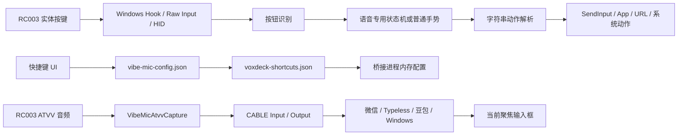
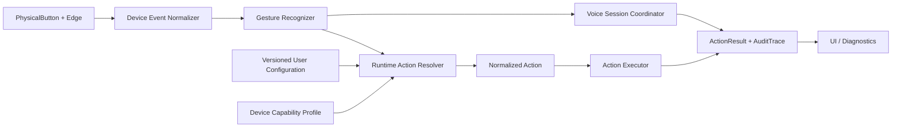

# 言灵 · Vibe Flow Remote 产品审计

> 审计日期：2026-09-01
> 审计对象：`feature/v1.3-custom-key-mapping`，HEAD `d6eb876`
> 稳定基线：`v1.2.1` / `origin/main` / `047f9d3`
> 审计结论：**HOLD。v1.3 候选版暂不具备发布条件。**
> 本文只记录审计、产品设计和实施建议，不代表这些建议已经实现。

> 实施更新：本文前 23 节保留最初审计快照，实际修复状态以第 24 节为准。当前软件侧 P0 已完成 revision ACK、schema 28 迁移、Power 能力下线、APP 前台激活校验和可复现 Capture 固定；发布仍受真机矩阵、多 DPI 截图与 Authenticode 决策约束。

## 1. 执行摘要

Vibe Flow 已经不是一个简单的概念验证。项目拥有三进程 Windows 架构、RC003 ATVV 音频链路、设备范围的 Raw Input、稳定录音内核、首次教程、自检、日志、安装器和公开发布流程。`v1.2.1` 也已经形成了一个可工作的核心闭环：

```text
聚焦输入框 -> 按住录音 -> 遥控器真实音频 -> 第三方语音工具转写
-> 松开结束 -> 文字留在原输入框 -> 确认键发送
```

当前最重要的问题不是缺少更多动作，而是**配置可信度和发布可信度不足**。用户看到“开机键短按 -> 打开 App”时，系统必须能证明实体开机键被识别、运行时加载了同一配置、只解析出一个动作，并且最终执行结果与 UI 完全一致。当前实现尚不能保证这一点。

本次审计确认 4 个直接发布阻断缺陷，以及 1 个必须补齐的配置完整性测试门禁：

1. **配置保存后，Raw Input/HID 路径可能继续使用旧映射。** UI 与运行时存在不同步窗口，可直接造成“UI 显示 A，实体键执行 B”。
2. **schema 27 迁移会无条件清空开机键短按和长按配置。** 这可以解释升级或重新连接后需要重新设置的现象。
3. **开机键实体事件没有被当前真机证据证明。** 当前日志中的“开机键测试成功”只是 UI 直接调用 Action Executor，不是实体按键触发。
4. **发布构建无法从干净 checkout 复现。** 构建和校验依赖 `scripts/Install-VBCable.ps1`，但 `.gitignore` 排除了该文件；GitHub 上 `v1.2.1` 的四次相关构建均失败。

因此，正确路线不是继续增加双击、宏和 Smart Profile，而是先完成以下顺序：

1. 建立按钮能力真相表和硬件验收证据。
2. 建立配置到执行的单一事实来源。
3. 修复配置迁移、热加载和干净构建。
4. 用配置完整性测试证明 UI、持久化、运行时和执行结果一致。
5. 在此基础上再做 Profile、上下文动作和安全的 Multi Action。

### 1.1 应冻结的稳定资产

在完成上述工作时，以下语音资产应视为冻结区，除非有独立分支、独立候选包和完整真机回归，不得顺手调整：

| 项目 | 已验证值 |
| --- | --- |
| 捕获内核 | `v1.0.3` |
| 语音状态机 | `v11` |
| 交互 | 按住说话，松开结束 |
| 单段边界 | RC003 自然边界，约 60 秒 |
| 增益 | `1.0` |
| 音频处理 | `speech` |
| 排空时间 | `180 ms` |
| 播放端点 | `CABLE Input` |
| 语音工具采集端 | `CABLE Output` |
| 微信输入法 | `Ctrl + Win`、toggle、`80 ms` |
| 文本交付 | 由语音工具直接写入已聚焦输入框，不走剪贴板回填 |

## 2. 审计范围、方法与证据边界

### 2.1 已检查内容

- 根目录 README、快速开始、CHANGELOG、版本说明和架构文档。
- 三个 C# 进程及其配置、事件、日志、迁移、自检、动作执行和生命周期代码。
- 默认配置、桥接配置、构建脚本、Inno Setup 安装器和 GitHub Actions。
- 当前 `v1.3.0-preview` 候选包及运行日志，但未重启、替换或干扰当前进程。
- `v1.2.1` 与 `v1.3` 浅色、深色 UI 截图，以及 11 步首次教程截图。
- GitHub Releases、Issues 和 Actions 的公开状态。
- 参考项目 `HD838A/remote-mic-app` 的代码分层、HID 模型、测试和设计 QA。
- Stream Deck、PowerToys、Windows Voice Typing/Voice Access、AutoHotkey、Flow Launcher、Touch Portal、VS Code、Codex、Claude Code、Windsurf 和 GitHub 的官方资料。

当前环境没有名为 UI Design、UX Research、Windows Desktop Design、Accessibility 或 Design System 的专用 skill。本文使用 Nielsen Heuristics、Cognitive Load、Progressive Disclosure、Recognition over Recall、Error Prevention、Fitts's Law、Windows 桌面交互和无障碍准则进行人工审查，不声称调用过不存在的 skill。

### 2.2 未声称完成的验证

- 没有在多台 Windows 电脑和多个 RC003 固件版本上完成矩阵测试。
- 没有在全新 Windows 虚拟机中走完下载、安装、重启、升级和卸载。
- 没有捕获到当前硬件的实体 Power、Back、独立 Volume+、Volume- 稳定事件。
- 没有完成 `v1.3` 的 100 次实体按键手势、睡眠恢复和升级验收。
- Cursor 官方文档当前被站点安全检查拦截，因此本文不把未经验证的 Cursor 默认快捷键写成产品事实。
- 自动化自测只能证明模拟契约，不能替代真机行为。

### 2.3 证据等级

| 等级 | 定义 | 可否对外宣传 |
| --- | --- | --- |
| A | 当前代码、当前真机日志和重复人工验收三者一致 | 可以 |
| B | 代码与历史或单次真机证据一致，但缺少当前完整重复验收 | 仅可标记 Beta 或“已检测” |
| C | 只有代码、模拟测试或“立即测试”结果 | 不可宣传为实体键能力 |
| D | 推测、默认映射或尚未捕获 | 不可展示为可配置能力 |

“立即测试成功”只证明 Action Executor 能执行动作，不证明实体遥控器能产生对应事件。

## 3. 当前产品与技术架构

### 3.1 当前三个进程

| 进程 | 当前职责 | 主要风险 |
| --- | --- | --- |
| `VibeMic.exe` | WinForms UI、配置、教程、自检、恢复、更新、托盘 | 单文件接近一万行，保留多套 Legacy 页面和旧模型 |
| `VoxDeckInputBridge.exe` | Low-level Hook、Raw Input/HID、手势、动作执行 | 配置热加载路径不一致，动作模型为字符串协议 |
| `VibeMicAtvvCapture.exe` | BLE ATVV、ADPCM 解码、VB-CABLE、语音工具生命周期 | 核心稳定但高度敏感，应冻结并独立验收 |

### 3.2 当前数据流



### 3.3 当前配置事实并不完全单一

目前至少存在以下表达：

1. UI 内的 `VibeMicConfig.mappings`。
2. 安装目录中的 `vibe-mic-config.json`。
3. UI 生成的 `voxdeck-shortcuts.json`。
4. 桥接进程内存中的 `BridgeConfig`。
5. `VoxDeckInputBridge` 内的默认映射。
6. Voice 按钮不走普通动作映射，而走专用事件和捕获状态机。

Voice 使用专用状态机本身是合理的，因为它有真实音频、按住、释放和资源所有权语义；问题在于系统没有对这种例外建立明确契约，也没有统一的配置 revision 和端到端 trace。

## 4. 完整用户生命周期审计

评分范围为 1 到 5。1 表示主要依赖用户猜测，5 表示路径清楚、可恢复且有证据。

| 阶段 | 用户目标 | 当前状态与优点 | 主要问题 | 评分 | 优先级 |
| --- | --- | --- | --- | ---: | --- |
| 发现产品 | 3 秒内理解产品价值和适用硬件 | README 首句说明“按住说话，松开结束” | 产品定位仍偏“遥控器麦克风”，AI Coding 控制器价值没有形成可验证主线 | 3 | P2 |
| 下载 | 找到正确安装包 | README 顶部有固定 EXE、ZIP、SHA-256 链接，并提醒不要下载源码包 | 安装包未签名；最新 CI 失败会削弱“可重建”的信任 | 3 | P0/P1 |
| 安装 | 安全完成安装并知道依赖 | Inno Setup 使用当前用户权限，安装后可启动 | SmartScreen 摩擦；VB-CABLE 是额外驱动，首次用户不理解为什么需要 | 2 | P1 |
| 首次启动 | 立即知道下一步 | 未完成设置时自动打开教程，支持重启续接 | 11 个显式步骤认知负担高；“桥接”等技术语言过早暴露 | 3 | P1 |
| Windows 权限 | 给出最小必要权限 | 不要求管理员运行主程序，诊断音频需显式授权 | 权限、驱动和第三方工具责任边界分散在多个页面和文档 | 3 | P1 |
| 蓝牙配对 | 配对正确遥控器 | 教程可打开 Windows 设置并自动检测 | “已配对”“已连接”“ATVV 就绪”“有 Raw Input 设备”容易被用户当成同一个状态 | 3 | P1 |
| 遥控器识别 | 确认拿到的是 RC003 事件 | Raw Input 用设备范围确认，避免普通键盘被错误抑制 | Power/Back/Volume 没有稳定报告，但预览 UI 仍可能展示实验能力 | 2 | P0 |
| 硬件按键识别 | 知道每个实体键是否可用 | 有实时日志、学习入口和遥控器高亮 | UI 动作测试和实体键识别混在同一成功体验中；缺少逐键证据等级 | 2 | P0 |
| 麦克风与音频 | 让 RC003 音频真正进入语音工具 | 稳定内核、真实音频驱动 UI、VB-CABLE 自检和诊断 WAV 已具备 | 用户仍需理解 Input/Output 命名反转；自检可能因桥接健康条件误报 | 3 | P1 |
| 语音工具配置 | 选择微信、Typeless 等并验证快捷键 | 支持多 Provider、触发方式和测试 | “快捷键能唤起”不等于“工具使用了 CABLE Output”或“文字写入原输入框” | 3 | P1 |
| 首次成功输入 | 尽快完成一次真实转写 | 教程包含真实输入框和成功状态 | 完成页可能左侧全绿但标题仍显示需要处理，状态语义冲突 | 3 | P1 |
| 快捷键配置 | 看懂哪个实体键执行什么 | 遥控器示意图、动作分类、立即测试已有基础 | UI 保存与 runtime 可能不同步；实验按键能力展示过强；动作字符串缺少类型约束 | 2 | P0 |
| 日常使用 | 开机后拿起即用 | 单实例、后台启动、睡眠/解锁恢复、桥接心跳均已实现 | 健康判断强制依赖 Raw Input 设备存在，可能在 Hook 可用时仍反复恢复 | 3 | P1 |
| 异常处理 | 知道为什么失败和怎么修 | 10 项自检提供预期、当前、原因、下一步，方向正确 | 摘要同时显示分数、错误数和多个“检测中”；部分检查名大于真实检查能力 | 3 | P1 |
| 更新 | 安全升级且配置不丢 | 有版本检查、HTTPS、SHA-256、用户确认和原子配置 | schema 27 会清空 Power 映射；CI 失败；签名未配置 | 1 | P0 |
| 卸载 | 明确删除范围 | 标准卸载并清理运行状态 | 卸载器删除主配置与 `.bak`；用户没有恢复导入入口 | 2 | P1 |
| 重装/恢复 | 恢复自己的工作流 | 设置页可以导出配置 | 只有“备份配置”，没有图形化导入、兼容检查和恢复流程 | 2 | P1 |

### 4.1 生命周期的核心断点

当前最大的流失点不是页面不够漂亮，而是以下三个“信任断点”：

1. 用户配置后无法确认实体键是否真的使用新配置。
2. 出错时自检可能把技术状态说得比实际证据更确定。
3. 升级和重装不能保证个性化配置可恢复。

## 5. Hardware Event -> Action Routing 审计

### 5.1 分层审计

| 层级 | 当前实现 | 已确认风险 | 目标状态 |
| --- | --- | --- | --- |
| Physical Button | RC003 语音、方向、确认、Home、TV、Fn 有日志 | Power/Back/Volume 不稳定或未捕获 | 只有通过当前硬件验收的按钮才能出现在正式配置 UI |
| Bluetooth/HID | Raw Input keyboard + consumer 注册，按设备名确认 RC003 | 蓝牙重连可能替换 handle；不同固件报告可能不同 | 建立设备能力探测结果和固件/设备指纹，不把默认 usage 当事实 |
| Raw Event | 记录 VK、Scan、HID usage | 日志量大，但缺少统一事件 ID | 每次物理交互生成 correlation ID |
| Button Identification | VK/Scan 和 HID usage 映射到 name | UI ID、桥接 name、中文名和 HID usage 由多个地方维护 | 使用稳定 `button_id` 枚举和设备 profile |
| Press/Release | 普通键和 Voice 都有重复边缘去重 | 断连时只有部分状态会合成释放 | 所有活动 gesture session 都支持 cancel/release |
| Gesture | 普通键支持 tap、short/long、hold；Voice 专用 hold/release | 没有 double press；不同 trigger 的优先级未成为产品契约 | 建立统一手势状态机和每键能力声明 |
| Mapping | UI 配置生成 bridge JSON | Raw/HID 路径可能不热加载；迁移会覆盖值 | 单一事实源、revision、原子 publish、ACK |
| Action Resolution | 字符串前缀分派 | 无 schema 级 payload 校验，默认和用户值容易混用 | Typed `NormalizedAction` |
| Executor | SendInput、App、URL、Task View 等 | UI 测试绕过硬件，容易被误认为实体成功 | Executor 结果与实体 trace 分开显示 |
| UI Status | Toast、遥控器高亮、状态条 | 隐藏桥接状态与主 UI 状态并非同一观察源 | UI 订阅统一 ActionResult 和硬件事件流 |
| Persistence | 原子写入并保留 `.bak` | 升级迁移可主动清空；无导入恢复 | 迁移幂等、可回滚、可导入、保留未知字段 |

### 5.2 已定位的路由一致性缺陷

`VibeMic.cs:3434-3492` 在启动桥接前生成 `voxdeck-shortcuts.json`，但如果同路径桥接心跳健康，会直接复用现有进程。`VoxDeckInputBridge.cs:280-342` 只在 Low-level Hook 回调进入时调用 `ReloadConfigIfChanged()`。`VoxDeckInputBridge.cs:1512-1579` 的 Raw Input/HID 路径直接调用 `FindMapping()` 和 HID usage handler，没有先刷新配置。

这会形成以下竞态：

```text
UI 保存新映射
  -> bridge JSON 已更新
  -> 健康 bridge 被复用
  -> 下一次事件只走 Raw Input/HID
  -> 内存仍是旧 mapping
  -> 实体键执行旧动作
```

Hook 路径随后出现一次事件时，配置才可能被刷新。这个行为不可预测，也会让“断开重连后要重新设置”看起来像配置丢失。

### 5.3 配置迁移缺陷

`VibeMic.cs:7533-7540` 对所有 schema `< 27` 配置执行：

```csharp
value.mappings["电源键:short"] = "none";
value.mappings["电源键:long"] = "none";
```

这不是“无效值修复”，而是无条件覆盖用户值。即使旧配置中的 App/URL 动作合法，也会在升级时丢失。

迁移必须满足：

- 幂等，多次运行结果不变。
- 只修复缺失或非法字段，不覆盖合法用户值。
- 能读取旧 schema，也能保留当前版本不认识的扩展字段。
- 每个 schema 跨度都有 fixture 测试。
- 迁移前保留可恢复快照，并在失败时回滚。

## 6. Button Capability Matrix 按钮行为真相表

下表描述的是本次审计看到的证据，不是产品愿望。

| 物理按钮 | 当前 Windows 事件 | 当前实际路径 | 当前 UI 能力 | 期望正式能力 | 单击 | 双击 | 长按/按住 | 稳定性 | 证据 |
| --- | --- | --- | --- | --- | --- | --- | --- | --- | --- |
| Voice | `VK 0x74 F5`，Scan `0x3F` | 专用 hold/release -> 捕获进程 | 固定语音，不参与普通映射 | 保持专用按住说话 | 不适用 | 禁止 | 按下开始、松开结束 | 高 | A |
| Up | `VK 0x26`，Scan `0x48` | Raw Input + passthrough/动作 | 可配置单动作 | 导航或单动作；可选 repeat | 是 | 未实现 | 仅明确可重复动作 | 高 | A |
| Down | `VK 0x28`，Scan `0x50` | Raw Input + passthrough/动作 | 可配置单动作 | 同 Up | 是 | 未实现 | 仅明确可重复动作 | 高 | A |
| Left | `VK 0x25`，Scan `0x4B` | Raw Input + passthrough/动作 | 可配置单动作 | 同 Up | 是 | 未实现 | 仅明确可重复动作 | 高 | A |
| Right | `VK 0x27`，Scan `0x4D` | Raw Input + passthrough/动作 | 可配置单动作 | 同 Up | 是 | 未实现 | 仅明确可重复动作 | 高 | A |
| OK | `VK 0x0D`，Scan `0x1C` | 默认 Enter passthrough | 预览可显示/配置 | 默认 Enter，是否开放配置需产品决策 | 是 | 未实现 | 未验证 | 高 | A |
| Home | `VK 0x24`，Scan `0x47` | short/long gesture | 预览支持短按/长按 | 可配置前必须完成 100 次真机回归 | 是 | 未实现 | 代码支持，真机回归不足 | 中 | B |
| TV | `VK 0xC0`，Scan `0x29` | tap -> Task View | 当前固定 Task View | 可保留固定动作，后续再评估 Profile | 是 | 未实现 | 当前不支持 | 中高 | B |
| Fn/Menu | `VK 0x5D`，Scan `0x5D` | short/long gesture | 短按/长按 | 可作为两个高频编辑动作 | 是 | 未实现 | 代码支持 | 中高 | B |
| Power | 代码假设 `F20/0x6B` 或 HID `0x07/0x66` | 预览中有映射和动作测试 | 主要配置画布展示 | 探测到稳定实体报告后才解锁 | 未证明 | 未实现 | 未证明 | 未知 | D |
| Back | 当前稳定日志无可靠事件 | 正式版不路由 | 不应展示 | 保持隐藏，直到能力探测通过 | 未证明 | 未实现 | 未证明 | 未知 | D |
| Volume+ | 当前稳定日志无可靠独立事件 | 正式版不路由 | 不应展示 | 保持隐藏，不能拿方向键伪装成独立键 | 未证明 | 未实现 | 未证明 | 未知 | D |
| Volume- | 当前稳定日志无可靠独立事件 | 正式版不路由 | 不应展示 | 同 Volume+ | 未证明 | 未实现 | 未证明 | 未知 | D |

### 6.1 Power 的当前证据为什么不成立

当前候选日志中可看到：

```text
Gesture action executed label=开机键长按 phase=测试 action=open-exe:... success=True
Gesture action executed label=开机键短按 phase=测试 action=win+d success=True
```

这两条记录来自 UI 的“立即测试”。同一日志中没有对应的实体 `F20/0x6B`、`VK 0x83` 或 HID usage `0x66` 报告。因此只能证明 App/快捷键动作可执行，不能证明 Power 按键可用。

正式 UI 应将按钮分为：

- `已验证`：实体事件已捕获并通过回归。
- `已检测`：本机本次会话捕获到事件，但尚未完成回归。
- `不可用`：Windows 当前没有提供稳定报告。
- `实验`：仅在高级模式中显示，并明确不进入正式承诺。

## 7. P0 / P1 / P2 问题清单

### 7.1 P0 发布阻断

#### P0-1 UI 配置与运行时可能不一致

- **影响**：用户配置 Power/Home/Fn/方向键后，实体键可能执行旧动作。
- **证据**：Hook 路径热加载，Raw/HID 路径不热加载；健康桥接被直接复用。
- **修复原则**：配置写入后发布 revision，桥接原子加载并回 ACK；所有事件源在同一 revision 上解析。
- **验收**：每个可配置按钮都通过 `UI -> config -> bridge -> resolver -> executor` 完整性测试，不能靠重启生效。

#### P0-2 schema 27 清空合法 Power 配置

- **影响**：升级、重新加载或候选切换后用户配置丢失。
- **证据**：`VibeMic.cs:7533-7540` 无条件写 `none`。
- **修复原则**：只填缺省，不覆盖合法值；添加 schema 23、24、25、26 到当前版本的 fixture。
- **验收**：合法 App、URL、shortcut 的短按和长按值迁移后逐字保持。

#### P0-3 未证明的 Power 能力被主要 UI 展示

- **影响**：形成“配置成功但按键无效”或被 Voice 默认逻辑覆盖的体验。
- **证据**：当前只有 UI 测试成功，没有实体报告。
- **修复原则**：Capability Gate。未检测到实体事件时隐藏或禁用，并说明原因。
- **验收**：在目标机器连续 100 次短按、长按和断连重连，实体 trace 与动作一一对应。

#### P0-4 干净 checkout 无法构建发布包

- **影响**：开源用户和 CI 无法复现官方二进制，发布供应链不可信。
- **证据**：
  - `BUILD_RELEASE.ps1:101` 必须复制 `scripts/Install-VBCable.ps1`。
  - `scripts/validate.js:25` 也把它列为必需文件。
  - `.gitignore:54` 排除 `scripts/*.ps1`，该文件不在 `git ls-files`。
  - GitHub `v1.2.1` 的四次构建均在“Validate source and defaults”失败；`v1.2.0` 的对应构建成功。
- **修复原则**：追踪必要脚本，并在临时 clean clone 中执行完整发布构建。
- **验收**：GitHub Actions 成功产出 EXE、ZIP、SHA-256，产物与同 SHA 的本地 clean build 可解释地一致。

#### P0-5 缺少 Configuration Integrity Test

- **影响**：单元测试可通过，但 UI 和硬件行为仍错配。
- **修复原则**：给每次动作解析输出 `button_id + trigger + config_revision + action_id + result`。
- **验收**：对所有公开按钮和动作类型验证 configured、persisted、loaded、resolved、executed 五阶段。

### 7.2 P1 高优先级

1. **自检名称超过真实检查能力。** “本地核心组件与单实例状态”只检查文件、版本和当前捕获 runtime，没有统计所有同名进程。证据见 `VibeMic.cs:5685-5699`。
2. **桥接健康条件过严。** `VibeMic.cs:3466-3471` 和 `3558-3563` 强制要求 `raw_input_device_present=true`；Hook 可正常兜底时也可能被判断为不健康并反复重启。
3. **停止桥接可能误杀其他便携版本。** `VibeMic.cs:3516-3529` 枚举并结束所有同名进程，没有先按安装 root 过滤。
4. **卸载会删除配置和 `.bak`。** `installer/VibeFlow.iss:63-69` 清理主配置；当前只有备份导出，没有图形化导入恢复。
5. **官方安装包和三个 EXE 未签名。** 本地 `Get-AuthenticodeSignature` 均为 `NotSigned`，会增加 SmartScreen 和安全软件摩擦。
6. **安全文档过时。** `SECURITY.md:13` 仍描述 UI Automation、剪贴板序号和 `Ctrl+V` 回填，而当前架构明确为 provider-direct、clipboard-free。
7. **架构文档 schema 过时。** `docs/ARCHITECTURE.md` 仍写 schema 25，预览代码为 27，bridge schema 为 5。
8. **候选截图未同步到发布文档。** `docs/images` 除首次页外，与 `artifacts/v1.3-ui-preview-light` 的页面哈希不同。
9. **Legacy 实现仍在生产源文件。** 快捷键页、设备页、教程和自检均保留 Legacy 方法，增加误调用和回归面。
10. **动作结果对主 UI 不透明。** hidden bridge 有状态文字和日志，但主 UI 没有统一 ActionResult 流。
11. **第三方 Provider 验证不完整。** 能发送快捷键不代表目标工具已监听、已选择 `CABLE Output`、已写入原输入框。
12. **测试的“100 次”主要是状态机模拟。** 它不能替代 RC003 的 100 次实体短按、长按、重复 DOWN、丢失 UP 和重连。

### 7.3 P2 产品质量与增长

1. 首页仍以“语音桥接已暂停”“启动语音桥接”等技术概念为主，用户不能在 3 秒内直接得到“现在可以说话吗”。
2. 状态条同时展示蓝牙、遥控器麦克风、语音数据和转写工具，主次关系不清楚。
3. 快捷键页把“识别实体键”和“测试动作执行”混成一个成功状态。
4. 自检同时显示 `4/10`、错误数和多个“检测中”，摘要认知负担高。
5. 首次教程显式呈现 11 步；底层检测可以细，但用户任务不应被拆成 11 次确认。
6. 深色主题层级依赖高对比描边，紫色、绿色和红色较硬；需要更多中性色层级而不是更多光效。
7. 缺少 Profile 导入、导出、复制和恢复，用户无法积累和分享自己的工作流。
8. 缺少可靠的前台 App Profile 之前，不应直接增加 Context-aware Action。

## 8. 目标架构：单一事实来源

### 8.1 目标链路



### 8.2 推荐配置模型

```json
{
  "schema_version": 1,
  "revision": 42,
  "profile_id": "global-default",
  "bindings": [
    {
      "button_id": "home",
      "trigger": "short_press",
      "action": {
        "type": "launch_app",
        "target": "C:\\Program Files\\Microsoft VS Code\\Code.exe"
      }
    }
  ]
}
```

关键约束：

- UI 只编辑这一份模型，不直接生成另一套业务默认。
- bridge 接收带 revision 的不可变快照，并返回加载 ACK。
- Resolver 只读取已 ACK 的 revision。
- 默认值由版本化 Default Profile 提供，不散落在 UI、迁移和 Executor 中。
- `button_id`、`trigger` 和 `action.type` 使用枚举，不使用中文显示名作为主键。
- UI 显示名来自本地化资源，不参与运行时匹配。
- Voice 可以表现为 `voice_input` Action，但必须委托给冻结的 Voice Session Coordinator，不能退化成普通 TapShortcut。

### 8.3 推荐 Action 类型与阶段

| Action | 用户价值 | 风险 | 建议阶段 |
| --- | --- | --- | --- |
| Keyboard Shortcut | 高频编辑、导航、AI 命令 | 快捷键冲突、权限窗口 | 第一阶段 |
| Launch / Focus App | 快速进入 Cursor、VS Code、Terminal 等 | 路径变化、多个窗口 | 第一阶段 |
| Open URL | 打开 GitHub、项目、Agent 网页 | URL 安全、默认浏览器 | 第一阶段 |
| System Action | 桌面、任务视图、截图 | Windows 版本差异 | 第一阶段 |
| Media / Volume | 媒体控制 | 实体按钮能力不足 | 仅绑定到已验证按钮 |
| Voice Input | 核心输入 | 音频资源和 Provider 生命周期 | 冻结专用实现 |
| Text Input | 固定短文本 | 隐私、焦点、编码 | 第二阶段，需明确预览 |
| Window Management | 分屏、聚焦窗口 | 多显示器和权限 | 第二阶段 |
| Multi Action | 一键打开工作环境 | 失败、取消、竞态 | 第三阶段 |
| Conditional Action | 按前台 App 变化 | 不可预测、调试困难 | Smart Profile 后 |
| Run Command | 开发自动化 | 任意代码执行 | 高级模式，默认关闭 |

### 8.4 Action 安全分级

- **安全默认**：快捷键、已安装 App、HTTPS URL、系统截图、任务视图。
- **需要确认**：固定文本、打开本地文件/文件夹、窗口布局。
- **高级危险**：命令、脚本、任意协议 URI、多动作中的外部进程。
- 高级动作默认关闭，首次启用要显示作用范围；导入 Profile 时逐项列出危险动作。
- Macro 必须有总超时、步骤超时、取消、失败策略和结构化日志。
- 不默认执行来自社区 Profile 的任意 shell 命令。

## 9. 单击、双击、长按与按住模型

### 9.1 推荐优先级

```text
DOWN
  -> 创建唯一 gesture session
  -> 忽略同一物理周期内的重复 DOWN

达到 long threshold
  -> 若该键允许 long，执行 long 一次
  -> 抑制 single

UP
  -> 若 long 已触发，只结束 session
  -> 若启用 double，进入 220-280 ms 等待窗口
  -> 若未启用 double，立即执行 single

第二次完整 DOWN/UP 到达
  -> 执行 double 一次
  -> 抑制两次 single
```

### 9.2 产品规则

- Voice 不参与通用 single/double/long。它只允许 press、hold、release、cancel。
- 方向键和未来已验证的音量键可以使用 hold repeat；App/URL/截图不允许 repeat。
- 开启 double 会让 single 产生可感知延迟，必须按按钮单独开启，不应全局默认。
- Long 触发后，Release 不再触发 Short。
- 断连、睡眠、退出和设备 handle 更换必须取消所有 gesture session 并释放注入的修饰键。
- UI 用“短按 / 双击 / 按住”三张明确卡片表达，不能只给一个抽象 Trigger 下拉框。
- 未经实体能力验证的 trigger 不显示。

## 10. UI/UX 专业审查

### 10.1 Nielsen 与可用性问题

| 原则 | 当前问题 | 设计要求 |
| --- | --- | --- |
| 系统状态可见 | “桥接暂停”不等于用户理解的“不能说话” | 首页主状态只回答“可以使用 / 正在恢复 / 需要设置” |
| 系统与现实匹配 | Input/Output、ATVV、Raw Input 等术语过早暴露 | 普通模式使用“遥控器麦克风”“语音工具”“音频通道” |
| 用户控制 | 测试动作后无法确认实体映射是否已生效 | 显示“实体键已识别”和“动作执行成功”两个独立结果 |
| 一致性 | UI、JSON、bridge 默认和 runtime 可能不一致 | UI 只呈现 ACK 后的运行时 revision |
| 错误预防 | 未证明的 Power 能力仍可配置 | Capability Gate，在配置前阻止不可实现路径 |
| 识别优于记忆 | 用户要记住哪个键映射什么 | 遥控器图 + 按键标签 + 当前动作持续可见 |
| 灵活与高效 | 没有可复用 Profile | 提供 Starter Profile、复制、导入、导出 |
| 简洁 | 11 步和多层状态同时出现 | 4-6 个用户任务，细节由自动检测展开 |
| 错误恢复 | Failed 信息虽然丰富，但摘要过载 | 只突出第一个阻断项和一个主修复动作 |
| 帮助文档 | 教程较完整但版本截图会漂移 | 每次发布由同一 SHA 生成截图并校验哈希 |

### 10.2 首页应在 3 秒内回答的问题

推荐首页首屏：

```text
可以使用
RC003 已连接，遥控器麦克风和微信输入法已就绪

遥控器      已连接
麦克风      有真实音频
语音工具    微信输入法
当前 Profile Vibe Coding

录音键      按住说话
Home        打开 VS Code
Fn          复制 / 粘贴

[测试遥控器]  [配置按键]
```

当存在问题时，只保留一个主动作：

```text
还差 1 步
没有检测到 CABLE Output，遥控器声音无法交给微信输入法

[修复音频通道]
```

不建议首页继续使用“启动桥接”作为主 CTA。桥接是实现细节，正常情况下应自动维护。

### 10.3 页面级建议

#### 首页

- 主状态用完整短句，而不是多个同权重彩色点。
- 遥控器高亮必须来自真实实体事件，不能来自 hover 或模拟测试后冒充实机反馈。
- 录音波形只在真实解码音频到达后运动。
- 最近一次动作显示“Home 短按 -> VS Code，成功”，并带时间和 Profile。

#### 快捷键

- 左侧保持比例准确的遥控器，热点尺寸匹配实体按钮。
- 按实体键时高亮并选择对应配置项。
- 右侧先显示能力状态，再显示短按、双击、按住动作。
- “识别实体键”和“测试动作”使用不同按钮、不同反馈文案。
- 动作选择按“应用与网页、编辑、系统、媒体、高级”分组，不把所有内容塞进一个长下拉框。
- 保存成功后显示 revision 已被运行时加载，而不只显示“已保存”。

#### 语音

- 默认只显示语音工具、工具快捷键、音频通道状态和真实测试。
- 增益、处理模式、排空时间进入“高级语音诊断”，稳定档案默认锁定。
- 对每个 Provider 显示三个独立检查：能否启动、是否选择遥控器音频、是否写入原输入框。

#### 自检

- 顶部只显示一个结论和第一个阻断项。
- 每一项保留“正确状态、当前状态、原因、下一步”，这是当前最有价值的设计基础。
- “单实例”必须真的统计进程及安装 root；不能只检查文件版本。
- 修复后返回 App 自动重测当前项，不让用户从头开始。

#### 设置

- 保留浅色/深色即时切换。
- 增加“导入配置”和恢复预览，不只提供备份。
- 显示当前配置 schema、revision 和稳定语音档案，但放在高级信息。
- 更新区明确显示当前版本、最新稳定版、签名状态和回滚入口。

### 10.4 视觉与无障碍门禁

- 默认浅色，深色使用中性灰层级，减少高饱和紫/绿描边。
- 状态不能只靠颜色，必须同时有图标和文字。
- 中文正文不低于 12pt；按钮和列表支持 125%、150%、200% DPI。
- 键盘焦点可见，所有图标按钮有可访问名称和 tooltip。
- 支持 Windows 高对比度、减少动态效果和屏幕阅读器基础语义。
- 主要点击区域建议至少 36-40 px，高频实体热点不应过小。
- 不用持续发光证明“科技感”；动效只解释连接、实体按键和真实录音状态。

## 11. First Run Experience 重设计

底层仍然可以有 10 项检查，但用户不应完成 11 次机械点击。建议合并为 5 个任务：

### 任务 1：连接遥控器

- 自动检查蓝牙。
- 打开 Windows 添加设备。
- 自动识别 RC003，并要求按一个方向键确认当前设备。

完成条件：配对存在、设备已唤醒、收到当前 RC003 的真实事件。

### 任务 2：准备遥控器麦克风

- 检查 ATVV 服务和真实音频。
- 检查 VB-CABLE；缺失时解释“它把遥控器声音交给语音工具”。
- 需要重启时保存进度，重启后回到本任务。

完成条件：真实音频到达，`CABLE Input` 和 `CABLE Output` 可用。

### 任务 3：选择语音工具

- 微信、Typeless、豆包、Windows Voice Typing、其他。
- 预填推荐快捷键，但要求用户与第三方客户端实际设置核对。
- 显示 Provider 的触发方式和隐私边界。

完成条件：工具能被唤起，并确认采集端为遥控器虚拟麦克风。

### 任务 4：完成第一次真实输入

- 内置输入框自动聚焦。
- 用户按住录音、说一句固定短句、松开。
- 只在真实音频、一次开始、一次结束和文本变化都满足时通过。

完成条件：一次端到端成功，不以“快捷键已发送”代替。

### 任务 5：个性化并完成

- 可选配置 1 个已验证按键，不强迫配置所有按键。
- 选择是否随 Windows 启动。
- 显示“现在可以使用”和异常项入口。

完成条件：核心链路通过。按键个性化可以跳过，不阻断语音激活。

## 12. AI Coding / Vibe Coding 工作流研究

### 12.1 用户为什么会在键盘旁放一个遥控器

遥控器的价值不是替代完整键盘，而是覆盖键盘不方便或认知切换成本高的时刻：

1. 离开键盘思考时，按住说出一段修改意图。
2. 看 diff 或预览时，用少量实体键接受、拒绝、继续、停止或切换。
3. 在编辑器、终端和浏览器之间切换时，减少寻找窗口和组合键。
4. 把个人高频但难记的操作固化成一个可解释动作。
5. 把一套工作流保存成 Profile，换电脑或分享给他人。

### 12.2 高频动作分层

| 层级 | 建议动作 | 原因 |
| --- | --- | --- |
| 全局基础 | Voice、Enter、Copy、Paste、Undo、Redo、Screenshot、Task View | 跨 App 稳定，学习成本低 |
| 编辑器 | Command Palette、Quick Open、Find、Save、Terminal、Run、Stop、Next/Previous Tab | 高频，但快捷键可被用户修改 |
| AI Coding | Focus AI Input、Submit、New Chat/Task、Continue、Stop、Accept/Reject、Review Changes | 各产品命令不同，必须做 Profile 而非全局硬编码 |
| 浏览器 | Back、Forward、New Tab、Next/Previous Tab、Find、Scroll | 适合方向键和 TV/Home 类键 |
| 终端 | History Up/Down、Enter、Word Left/Right、Clear、New Terminal | 部分动作有破坏性，需明确上下文 |

VS Code 和 Codex 支持用户在 Keyboard Shortcuts 中绑定命令；Claude Code 的 keybindings 也可配置并热加载。产品应该保存“用户确认过的快捷键或命令绑定”，不应假设所有版本、语言和用户配置都相同。

### 12.3 建议的黄金场景

#### 场景 A：站着思考

按住 Voice，说出修改要求，松开后检查文本，再按 OK 发送。

#### 场景 B：代码审查

方向键浏览改动，Fn 复制/粘贴，Voice 解释问题，OK 提交追问。

#### 场景 C：启动工作环境

一个已验证按钮打开或聚焦编辑器。Multi Action 成熟后，再扩展为编辑器 + 终端 + 浏览器布局。

#### 场景 D：App 自动切换 Profile

VS Code 前台使用 Coding Profile，Chrome 前台使用 Browser Profile；用户始终能看到当前 Profile，并能一键锁定或退回 Global。

## 13. 竞品与参考项目结论

| 产品 | 值得学习 | 不应照搬 |
| --- | --- | --- |
| Stream Deck | Profiles、Smart Profiles、Multi Actions、备份恢复、Marketplace | 不复制多按钮硬件 UI；Vibe Flow 的优势是语音和低成本遥控器 |
| PowerToys Keyboard Manager | App 专属映射、启动 App、URI、冲突意识 | 它不区分多个键盘设备，Fn/保留键和提升权限窗口有限制 |
| AutoHotkey | down/up、Hook、上下文热键、自触发隔离 | 不把脚本语言直接暴露给普通用户，也不默认执行任意脚本 |
| Flow Launcher | App/文件/URL/系统动作、插件和便携配置 | 不把遥控器变成搜索框的复制品 |
| Touch Portal | 页面、多动作、视觉反馈、插件和社区分享 | 不在可靠性基础完成前堆叠动作和页面 |
| Windows Voice Typing | `Win+H`、文本框焦点、网络和麦克风前置条件 | 它不是遥控器音频桥，也不能证明第三方工具行为 |
| Windows Voice Access | 系统级语音控制和可访问性思路 | 产品目标仍应聚焦 AI Coding，不扩张成完整系统语音控制 |
| remote-mic-app | Button/Trigger/Action 分层、report->parse->edge->gesture->action 日志、迁移和硬件回归测试 | macOS IOHID、权限和系统事件机制不能直接套到 Windows |

参考项目最值得借鉴的不是某个具体按钮，而是**逐层可证明**：原始 report、解析结果、边缘、手势、动作和 UI 状态都有独立证据。

## 14. Profile、Smart Profile 与 Marketplace 路线

### 14.1 第一阶段：手动 Profile 和可迁移配置

- Global Default。
- Vibe Coding Starter。
- Browser Starter。
- Terminal Starter。
- Profile 新建、复制、重命名、重置。
- JSON 导出、导入、预览差异和 schema 校验。
- 导入时不自动接受危险动作。

### 14.2 第二阶段：Smart Profile

```text
前台进程变化
  -> 匹配显式规则
  -> 切换 Profile
  -> UI 与托盘显示当前 Profile
  -> 没有匹配时回退 Global
```

必须提供：

- 手动锁定当前 Profile。
- 规则冲突提示和优先级。
- 提权窗口无法注入时的可解释错误。
- 前台 App 切换日志，不记录窗口文本内容。
- 防抖，避免瞬时子进程导致 Profile 抖动。

### 14.3 第三阶段：Multi Action

首版只支持结构化动作：

```text
Launch App -> Wait -> Focus App -> Send Shortcut
```

必须包含：

- 每步超时和总超时。
- Stop/Cancel。
- `stop_on_failure` 或显式 fallback。
- 正在执行的 UI 状态。
- 逐步结果日志。
- 默认禁止 shell 命令。

### 14.4 第四阶段：Profile Marketplace

先做“纯配置模板仓库”，不要先做可执行插件市场：

- Profile、图标、动作模板和说明。
- schema、兼容版本、支持的设备能力和校验和。
- 社区 PR 审查和自动验证。
- 明确标记实验、第三方、危险动作。
- 一键导入前展示变更清单。

## 15. Remote Health Center 诊断系统

### 15.1 推荐状态模型

| 状态 | 含义 | UI |
| --- | --- | --- |
| Healthy | 当前链路已经被真实证据证明 | 绿色 + “正常” |
| Checking | 检测正在执行 | 蓝色 + 进度 |
| Setup Required | 用户尚未完成必要配置 | 橙色 + 一个主操作 |
| Failed | 已检测到明确错误 | 红色 + 原因和修复 |
| Unsupported | 当前硬件/系统不提供能力 | 灰色 + 解释，不建议重试 |
| Unknown | 没有足够证据 | 中性灰 + “尚未验证” |

`Unknown` 和 `Unsupported` 必须区别于 `Failed`。Power 没有事件时更接近 Unsupported/Unknown，而不是让用户无限“重新检测”。

### 15.2 每项检查的固定结构

```text
检查项：实体按键监听
正确状态：按下 RC003 时能收到设备范围事件
当前状态：已收到方向键；尚未收到 Power
原因：Windows 当前未暴露稳定 Power 报告
下一步：继续使用已验证按键；Power 配置已隐藏
证据：事件时间、button_id、source、config revision
```

### 15.3 日志建议

统一结构化 trace：

```json
{
  "event_id": "evt-...",
  "device": "hash:...",
  "source": "raw_input",
  "button_id": "home",
  "edge": "up",
  "gesture": "short_press",
  "config_revision": 42,
  "action_id": "launch-vscode",
  "result": "success",
  "duration_ms": 37
}
```

隐私要求：

- 不记录转译文字。
- 普通模式不保存音频。
- App 路径和 URL 在导出诊断时做最小必要披露或脱敏。
- 设备地址和完整设备路径继续哈希/截断。
- 日志轮转和总容量上限可配置。

## 16. 测试战略

### 16.1 测试金字塔

| 层级 | 必测内容 | 是否可替代真机 |
| --- | --- | --- |
| Unit | parser、edge、gesture、migration、action validation、conflict | 否 |
| Integration | config publish/ACK、resolver、executor、process lifecycle、provider event | 否 |
| Hardware | RC003 按键、ATVV、断连、睡眠、固件边界 | 不适用，必须真机 |
| Regression | 升级、重装、Profile、UI 行为一致性、发布包 | 否 |

### 16.2 按键测试矩阵

每个公开按钮至少验证：

- single press。
- long press，如果能力已启用。
- double press，如果能力已启用。
- repeated DOWN。
- duplicate UP。
- rapid 100 cycles。
- hold repeat，仅适用于可重复动作。
- 按住时断连。
- 睡眠/唤醒。
- 蓝牙关闭/开启。
- App 和 bridge 重启。
- 配置变更后无需重启立即生效。
- 普通键盘同名按键不被误拦截。

### 16.3 配置测试矩阵

- 默认配置。
- 保存和重载。
- 原子写失败。
- `.bak` 恢复。
- 损坏 JSON。
- schema 15 到当前 schema 的逐版本迁移 fixture。
- 升级和降级。
- 导入、导出、复制、重置。
- 未知字段保留。
- App 路径失效、URL 非 HTTPS、快捷键非法。
- 同一按钮动作冲突和系统保留快捷键。

### 16.4 Action 测试模板

每一种 Action 必须通过：

```text
configured
  -> persisted
  -> published with revision
  -> loaded and ACKed
  -> resolved from physical event
  -> executed once
  -> result shown in UI
```

### 16.5 Voice 回归门禁

- 100 次按住/松开，恰好 100 次开始和 100 次结束。
- 重复 DOWN 不创建第二会话。
- 重复 UP 不重复结束。
- 松开后不再开启第二个 Provider 麦克风。
- 约 60 秒边界正常结束，不宣传不支持的单段时长。
- 真实音频到达前 UI 不显示“正在收音”。
- 断连后释放 Provider、路由和按键状态。
- 文本由 Provider 直接写入已聚焦输入框，不读取或回填剪贴板。
- 微信、Typeless、豆包和 Windows Voice Typing 分别执行独立验收，不能互相代替。

## 17. 发布门禁

任何正式版本必须同时满足：

1. `npm test` 和三个原生 `--self-test` 通过。
2. 从全新 clone 构建成功，不依赖被忽略的本机残留文件。
3. GitHub Actions 对发布 commit 成功。
4. 安装器、EXE、ZIP、SHA-256 来自同一 commit 和同一构建记录。
5. Authenticode 已签名并带可信时间戳；如果仍未签名，不能称为“低摩擦正式版”。
6. Configuration Integrity Test 全量通过。
7. 公开按钮都达到 A 级证据；B/C/D 能力不进入稳定版主 UI。
8. 100 次真机手势、重连、睡眠和 Windows 重启验收通过。
9. 覆盖升级不丢配置，卸载前提供导出或保留选项，重装可导入。
10. 发布截图由该 commit 的真实 UI 自动生成，文档截图哈希一致。
11. 安全、架构、教程、CHANGELOG 和版本 schema 一致。
12. 候选清单中的 `installable` 与 `hardwareAcceptancePassed` 只有在真实门禁通过后才能为 `true`。

当前运行候选清单明确为：

```json
{
  "installable": false,
  "hardwareAcceptancePassed": false,
  "powerKeySupport": "experimental-hardware-report-required"
}
```

因此它不应被合并成正式下载版本。

## 18. 分阶段实施计划

### 阶段 0：审计确认

- 用户审核本文。
- 确认不扩大 `v1.3` 范围。
- 将 `v1.2.1` Voice 核心列为冻结模块。

### 阶段 1：Reliability Foundation

1. 修复 clean checkout 构建。
2. 修复 schema 27 迁移覆盖。
3. 为 bridge 配置增加 revision、主动 reload 和 ACK。
4. Raw Input、HID 和 Hook 统一使用同一配置快照。
5. 增加 Configuration Integrity Test。
6. Capability Gate 隐藏 Power/Back/Volume 未证明能力。
7. 修正单实例自检和按 root 停止进程。

**退出条件**：UI 显示 A、实体执行 A，连续 100 次无偏差。

### 阶段 2：Typed Action 与快捷键 UX

1. 引入 `ButtonId`、`Trigger`、`NormalizedAction`。
2. 将字符串协议放在兼容 adapter，UI 不再直接生产字符串。
3. 拆分“识别实体键”和“测试动作”。
4. 完成 App/URL/Shortcut/System/Screenshot 动作的端到端测试。
5. 主 UI 显示 ActionResult。

**退出条件**：每个公开 Action 通过完整 configured-to-executed 链路。

### 阶段 3：Onboarding 与 Health Center

1. 将 11 个技术步骤合并为 5 个用户任务。
2. 首页改为“可以使用 / 需要一步 / 正在恢复”。
3. 修复自检事实边界和完成页状态矛盾。
4. 加入导入配置和恢复预览。
5. 完成 DPI、浅色/深色和无障碍回归。

**退出条件**：零基础用户不看外部文档也能完成第一次真实输入。

### 阶段 4：Profiles

1. 手动 Profile、复制、导入、导出、重置。
2. 提供 Vibe Coding、Browser、Terminal Starter。
3. 所有模板只使用用户已确认的快捷键。
4. Profile 冲突和危险动作预览。

**退出条件**：配置可迁移、可恢复、可分享。

### 阶段 5：Smart Profiles 与 Multi Action

- 先做前台 App 自动切换和 Global fallback。
- 再做有超时、取消和失败处理的 Multi Action。
- 最后评估社区模板市场。

不得把阶段 5 的复杂度带回阶段 1 的稳定性修复。

## 19. 最值得做的 5 个产品能力

按价值、可行性和风险排序：

1. **可信按钮路由**：任何配置都能被实体键准确执行，这是所有扩展功能的前提。
2. **第一次成功输入向导**：自动检测蓝牙、真实音频、VB-CABLE 和 Provider，让用户尽快达到第一次成功。
3. **Remote Health Center**：从“报错”升级为“为什么、当前事实、下一步、是否修复成功”。
4. **可迁移 Profile**：让用户的个性化积累可以备份、恢复和分享，形成长期留存。
5. **Smart Profile**：可靠基础完成后，让编辑器、浏览器和终端自动使用各自的按钮语义。

Multi Action 很有吸引力，但不应进入当前最强 5 项的第一批实现。它依赖 Action、Profile、取消和日志基础。

## 20. 产品指标与留存

不建议做签到、积分等低价值游戏化。建议围绕“成功、稳定、形成个人工作流”建立指标。

### 20.1 激活指标

- 安装到第一次真实语音输入成功的时间。
- 首次教程完成率和每个任务的阻断原因。
- 第一次成功后是否配置至少一个按钮。

### 20.2 可靠性指标

- 物理事件到动作执行的成功率和 P95 延迟。
- Voice 开始/结束 exactly-once 比率。
- 配置 revision 不一致次数，应为 0。
- 重连、睡眠和开机恢复成功率。
- Provider 启动、真实音频、文本目标三段成功率。

### 20.3 留存指标

- 本地记录的周活跃天数、成功语音次数和快捷动作次数。
- Profile 创建、复制、导入和导出。
- 用户是否从 Global 发展到个人 Profile。

开源版本默认只保留本地聚合指标。任何网络遥测都必须明确 opt-in、最小化并公开 schema。

## 21. 当前版本的产品决策建议

### 立即决定

- `v1.2.1` 继续作为推荐稳定版。
- `v1.3` 保持 hardware candidate，不发布安装器。
- Power 从主要配置画布移除或标记为实验且默认隐藏。
- Back 和独立 Volume 继续不宣传。
- 不在当前修复中加入 double press、Smart Profile 或 Macro。

### 审计通过后实施

- 先修配置一致性、迁移、构建和测试门禁。
- 再实现 Typed Action 和真实 ActionResult。
- UI 改版必须以“下一步做什么”和“真实行为一致”为目标，不做孤立换肤。

## 22. 资料来源

### 本项目

- [Vibe Flow README](../README.md)
- [架构说明](ARCHITECTURE.md)
- [用户教程](USER_GUIDE_ZH.md)
- [CHANGELOG](../CHANGELOG.md)
- [VibeMic.cs](../scripts/VibeMic.cs)
- [VoxDeckInputBridge.cs](../scripts/VoxDeckInputBridge.cs)
- [VibeMicAtvvCapture.cs](../scripts/VibeMicAtvvCapture.cs)
- [GitHub v1.2.1 Release](https://github.com/richlearntodo-debug/vibe-flow/releases/tag/v1.2.1)
- [GitHub Issue #1](https://github.com/richlearntodo-debug/vibe-flow/issues/1)
- [GitHub Issue #2](https://github.com/richlearntodo-debug/vibe-flow/issues/2)
- [v1.2.1 失败构建记录](https://github.com/richlearntodo-debug/vibe-flow/actions/runs/33152374726)

### 竞品与官方资料

- [Stream Deck Smart Profiles](https://help.elgato.com/hc/en-us/articles/360053419071-Elgato-Stream-Deck-Smart-Profiles)
- [Stream Deck Multi Actions](https://help.elgato.com/hc/en-us/articles/360027960912-Elgato-Stream-Deck-Multi-Actions)
- [Stream Deck Profile Backup](https://help.elgato.com/hc/en-us/articles/360048424432-Elgato-Stream-Deck-How-to-Back-Up-and-Restore-Profiles)
- [PowerToys Keyboard Manager](https://learn.microsoft.com/en-us/windows/powertoys/keyboard-manager)
- [Windows Voice Typing](https://support.microsoft.com/en-us/windows/use-voice-typing-to-talk-instead-of-type-on-your-pc-fec94565-c4bd-329d-e59a-af033fa5689f)
- [Windows Voice Access](https://support.microsoft.com/en-us/topic/set-up-voice-access-9fc44e29-12bf-4d86-bc4e-e9bb69df9a0e)
- [AutoHotkey Hotkeys](https://www.autohotkey.com/docs/v2/Hotkeys.htm)
- [Flow Launcher](https://github.com/Flow-Launcher/Flow.Launcher)
- [Touch Portal](https://www.touch-portal.com/)
- [VS Code Keybindings](https://code.visualstudio.com/docs/configure/keybindings)
- [VS Code Terminal](https://code.visualstudio.com/docs/terminal/basics)
- [VS Code AI Chat](https://code.visualstudio.com/docs/copilot/chat/chat-agent-mode)
- [Codex IDE](https://developers.openai.com/codex/ide/features)
- [Codex Developer Commands](https://learn.chatgpt.com/docs/developer-commands?surface=ide)
- [Codex Prompting](https://learn.chatgpt.com/docs/prompting)
- [Claude Code Interactive Mode](https://code.claude.com/docs/en/interactive-mode)
- [Claude Code Keybindings](https://code.claude.com/docs/en/keybindings)
- [Windsurf Docs Index](https://docs.windsurf.com/llms.txt)
- [GitHub Keyboard Shortcuts](https://docs.github.com/en/get-started/accessibility/keyboard-shortcuts)
- [remote-mic-app](https://github.com/HD838A/remote-mic-app)

## 23. 审计验收清单

在进入代码实现前，应确认：

- [x] 接受“可靠性优先，v1.3 暂缓发布”的结论。
- [x] 接受 Voice 稳定内核冻结，不在快捷键重构中调整语音参数。
- [x] 接受按钮能力按 A/B/C/D 证据等级展示。
- [x] 接受 Power/Back/Volume 未通过真机门禁前不作为正式能力。
- [x] 接受先完成单一事实来源和 Configuration Integrity Test。
- [x] 接受 Profile 在基础动作稳定后实施，Smart Profile 和 Macro 后置。
- [x] 接受 UI 改版与真实状态模型一起完成，不做单独换肤发布。

审核通过后，下一份交付物应是阶段 1 的技术设计和最小变更清单，而不是直接扩展更多按钮功能。

## 24. 阶段 1 实施记录（2026-09-01）

用户已确认上述范围，Reliability Foundation 已进入实现。当前完成的是软件侧可靠性修复，不等同于 RC003 真机发布验收。

### 24.1 已实现

- schema 26 升级到 schema 27 时保留有效的 Home 和 Power 短按/长按配置；schema 24 的稳定方案回退策略保持不变。
- 增加迁移幂等测试，第二次迁移不得再次修改配置。
- 将 UI 配置归一化为唯一 bridge document；映射内容生成 SHA-256 revision。
- bridge 增加专用 reload 事件和 revision ACK；保存后只有运行时确认相同 revision，UI 才显示“已生效”。
- Hook、Raw Input 和 HID 在解析动作前共同检查当前配置；reload 后立即刷新健康文件。
- 健康文件增加 config version、revision、加载时间、映射数量和配置错误。
- RC003 暂时休眠或 Raw Input 设备未枚举到时，bridge 保持健康，不再因此反复重启；设备状态仍在自检中单独显示。
- Power 在没有真实硬件事件证据前禁止编辑和测试；Back、独立 Volume 继续不公开。
- 本机应用动作改为“聚焦运行进程 -> 当前 EXE -> Windows 开始菜单 AppID”三级回退；新配置同时保存进程、路径和可重启入口，旧 EXE 路径失效时不再阻止切换已运行窗口。
- 自检开始实际统计当前目录、其他目录和重复的捕获/按键桥接进程。
- 停止 bridge 和清理孤儿 capture 只作用于当前安装目录，不再按进程名影响另一份便携版。
- `scripts/Install-VBCable.ps1` 已从 `.gitignore` 例外放行，修复 clean checkout 缺失发布依赖的问题。
- 正式版和硬件候选构建不再重新编译或重新签名 Capture；构建只接受 SHA-256 为 `B62DE...E683` 的 v1.2.1 固定二进制，本地不存在时从固定 GitHub Release 下载并再次校验。

### 24.2 自动化结果

- `npm test`：通过。
- `VibeMic.exe --self-test`：通过。
- `VoxDeckInputBridge.exe --self-test`：通过。
- `BUILD_VIBE_MIC.cmd`：通过。
- `BUILD_INPUT_BRIDGE.cmd`：通过。

自测覆盖 schema 迁移、revision 变化、ACK 拒绝旧配置、UI 映射到 bridge action、bridge JSON 持久化与 runtime resolver、100 次短按/长按状态机以及 RC003 来源确认。

运行时额外验证了两种真实失败场景：已失效的 GameViewer 旧路径仍可聚焦当前运行窗口；EXE 不存在且目标未运行时可通过 Windows 开始菜单 AppID 启动应用。

### 24.3 尚未通过的发布门禁

- 当前测试目录已替换 Host/Bridge 并完成进程级运行时验证，但尚未完成正式安装包在线热升级测试。
- 仍需在隔离候选包中完成实体 RC003 的配置修改后立即执行验证。
- 仍需完成 100 次实体按下/松开、睡眠唤醒、蓝牙断开重连和 Windows 重启回归。
- Power 的 F20 / `0x83` / HID `0x07:0x66` 仍无可靠实机证据，不能作为正式能力发布。
- `scripts/Install-VBCable.ps1` 必须随本次代码一起提交，GitHub clean checkout 才会真正包含该文件。

阶段 1 只有在上述真机门禁完成后才能标记为完成；在此之前 `v1.3` 继续保持 hardware candidate。

### 24.4 阶段 3 与恢复能力进展

- 首次设置已从 11 个技术步骤合并为 5 项用户任务，并保留进度、VB-CABLE 重启续接、真实方向键和真实转译门禁。
- 快捷键正式页只展示 Voice、四方向、确认、Home、TV 和功能键；Power、Back、独立 Volume 不再提供入口。
- 本机 APP 选择器支持运行中/已安装搜索、图标和路径，并保存进程、EXE、开始菜单 AppID 三种启动依据。
- 设置页提供配置备份、导入和恢复上次；旧配置先迁移，再强制恢复稳定语音档案，避免导入破坏 Voice 冻结区。
- 诊断导出不再写入完整映射目标，并隐藏用户目录、电脑名、HID 路径、设备地址、URL 和应用动作载荷。
- 浅色、深色和跟随 Windows 已完成实际截图检查；主题切换不重启 Host、Bridge 或 Capture。
- 快捷键页提供通用导航、Vibe Coding、媒体控制三套单动作方案，不引入自动 Profile、宏、双击或复杂状态机。

上述软件能力已通过编译与自测，但 100 次实体录音、系统缩放矩阵、睡眠/唤醒、蓝牙重连、Windows 重启和覆盖升级仍属于发布门禁。

### 24.5 schema 28、APP 前台切换与 DPI 修复

- schema 28 不再保留任何 Power 运行时映射。旧候选版若把 APP/网页绑定到 Power，且 Home 长按为空，会把该动作迁移到 Home 长按；迁移有幂等 fixture。
- 默认配置、UI 配置、bridge document、Bridge 默认值和候选清单均已移除 Power 映射，避免“UI 隐藏但运行时仍监听”的双重事实。
- APP 动作不再把“找到窗口”当成成功。执行器会恢复窗口、尝试直接激活，并在 Windows 前台锁阻止时使用线程输入附加回退；只有 `GetForegroundWindow()` 确认目标窗口后才返回成功。
- 当前测试目录的 GameViewer 验证从旧实现的 `foreground=False` 变为 `foreground=true mode=attached_input`，证明已运行 APP 能真实切到前台。
- 主程序启用 Per-Monitor V2 DPI awareness，Windows 当前返回进程 awareness `2`；WinForms 使用 96 DPI 设计基线，并在显示区域不足时收缩窗口、保留页面滚动。
- 96 DPI 浅色首页和快捷键页已重新截图检查，无重叠、截断或布局回归。125%、150%、200% 需要在对应 Windows 显示缩放环境继续取证。
- 候选清单和校验脚本已同步到配置 schema 28，避免发布元数据继续声称 schema 27。

当前剩余门禁：实体 RC003 全按键与 100 次录音循环、蓝牙/遥控器/Windows 睡眠恢复、Windows 重启和覆盖升级、多 DPI 实机截图，以及正式发布前是否配置 Authenticode 证书。当前机器没有可用代码签名证书，因此不能声称安装包已签名。
