# 言灵 · Vibe Flow Remote v1.1.0 使用教程

这份教程面向第一次使用 RC003 蓝牙语音遥控器、没有编程基础的 Windows 用户。跟随应用内五步向导即可完成配置。

> **日常操作是按住说话：按下录音键开始，讲完后松开结束。** 松开后不要再按第二次。

> [!NOTE]
> RC003 固件会在一次物理长按约 60 秒时主动结束按键和音频流，因此稳定按住模式单次以约 60 秒为硬件上限；这不是微信输入法的时长限制。

## 快速导航

| 你的情况 | 直接查看 |
| --- | --- |
| 第一次安装 | [下载与安装](#下载与安装)，然后完成[从零开始](#从零开始) |
| 已安装旧版 | [覆盖升级](#覆盖升级) |
| 只想学会录音 | [日常按住听写](#日常按住听写) |
| 想修改遥控器按键 | [配置遥控器快捷键](#配置遥控器快捷键) |
| 录音、连接或转写异常 | [连接与自检](#连接与自检)和[按现象排查](#按现象排查) |
| 需要提交问题 | [导出安全诊断](#导出安全诊断) |

## 先理解一件事

言灵不负责识别文字。它把 RC003 麦克风的声音安全地送到你选择的语音转文字工具：

```text
RC003 麦克风
  -> Bluetooth ATVV
  -> 言灵
  -> VB-CABLE
  -> 微信输入法 / Typeless / Windows 语音输入 / 其他工具
  -> 当前输入框
```

因此一条完整链路需要四部分都正常：

1. RC003 已通过 Windows 蓝牙配对。
2. 言灵后台桥接已运行。
3. VB-CABLE 的 `CABLE Input` 和 `CABLE Output` 都存在。
4. 语音转写工具已启动，快捷键与言灵配置一致。

言灵普通运行时不保存录音、不读取识别文字，也不会自行上传音频。第三方转写工具是否联网和如何处理语音，以对应工具的隐私政策为准。

## 使用前准备

| 项目 | 要求 |
| --- | --- |
| 电脑 | Windows 10/11 x64，带 Bluetooth LE |
| 遥控器 | 小米 RC003 / MI RC 蓝牙语音遥控器 |
| 转写工具 | 微信输入法、Typeless、Windows 语音输入、Voquill 或其他支持全局快捷键的工具 |
| 本地音频驱动 | [VB-CABLE](https://vb-audio.com/Cable/)，只需安装一次 |

开始前建议先用实体键盘或鼠标确认：所选转写工具在电脑物理麦克风下可以正常听写。这样可以把“工具本身不可用”和“遥控器链路问题”分开。

## 下载与安装

只从 [GitHub Releases](https://github.com/richlearntodo-debug/vibe-flow/releases/latest) 下载正式文件：

| 文件 | 适合谁 |
| --- | --- |
| [`VibeFlow-Setup.exe`](https://github.com/richlearntodo-debug/vibe-flow/releases/latest/download/VibeFlow-Setup.exe) | **推荐。** 普通用户双击安装 |
| [`Vibe-Flow-Windows-x64.zip`](https://github.com/richlearntodo-debug/vibe-flow/releases/latest/download/Vibe-Flow-Windows-x64.zip) | 免安装用户，必须完整解压 |
| [`SHA256SUMS.txt`](https://github.com/richlearntodo-debug/vibe-flow/releases/latest/download/SHA256SUMS.txt) | 核对下载文件完整性 |

不要下载 GitHub 自动附加的 `Source code (zip)` 或 `Source code (tar.gz)`。它们是开发者源码，不是可直接使用的 Windows 安装包。

发布脚本已经支持 Windows Authenticode 签名，但具体 Release 是否带商业签名取决于发布者证书。Windows 首次运行若显示来源提示，请先确认下载地址属于本仓库并核对 `SHA256SUMS.txt`。

### 覆盖升级

安装版可直接运行新版安装包覆盖升级。免安装版请解压到新目录，再运行新目录中的 `VibeFlow.exe`。

升级不会覆盖现有 `vibe-mic-config.json`，因此转写工具、快捷键、开机启动和语音模式会保留。升级后在“偏好设置”确认版本为 `1.1.0`，再到“连接与自检”运行一次检查。

若仍看到旧界面，从系统托盘完全退出旧实例，然后从开始菜单或新解压目录重新打开。

## 从零开始

首次打开会自动进入五步向导：

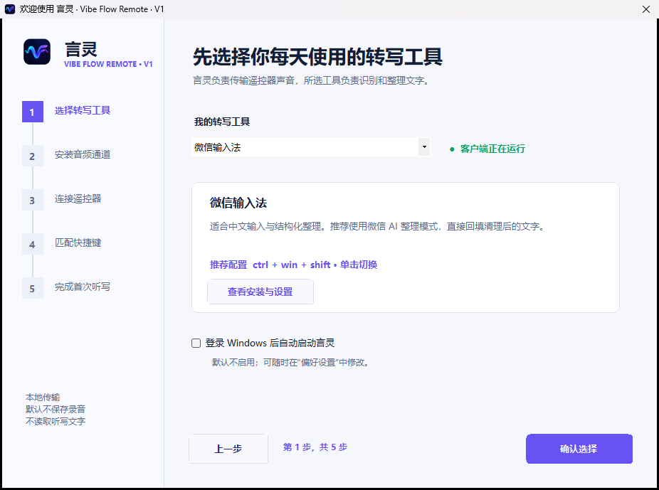

### 第一步：选择转写工具

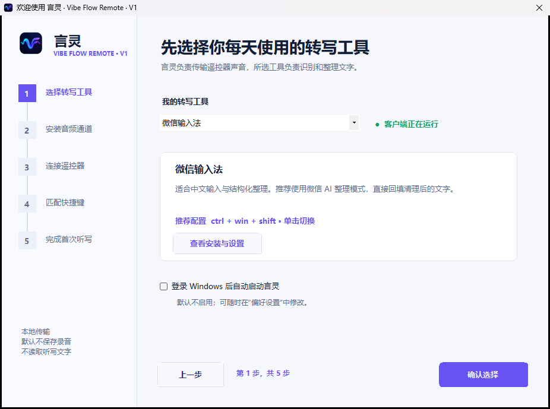

| 工具 | 推荐快捷键 | 触发方式 | 说明 |
| --- | --- | --- | --- |
| 微信输入法 | `Ctrl + Win + Shift` | AI 整理（单击切换） | 已完成 RC003 按住说话、松开提交与完整句尾真机验证 |
| Typeless | 常见为 `Right Alt` | 单击切换 | 已完成 RC003 端到端真机验证 |
| Windows 语音输入 | `Win + H` | 单击切换 | Windows 系统路径 |
| Voquill | 常见为 `Ctrl + Win` | 按住触发 | 以安装版本当前设置为准 |
| 其他语音工具 | 用户自定义 | 单击切换或按住触发 | 必须支持全局快捷键 |

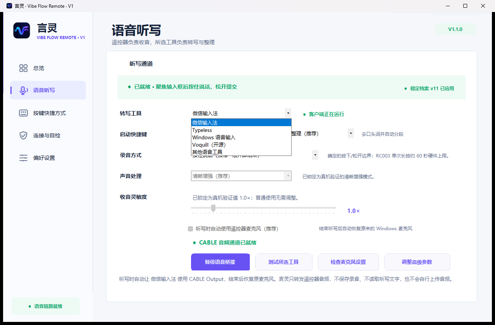

选择后可勾选“登录 Windows 后自动启动言灵”。默认不勾选，只有用户明确授权后才写入当前账户的开机启动项。

#### 微信输入法

1. 先启动微信输入法并完成登录或初始化。
2. 在微信输入法设置中开启“语音智能整理”，确认 `Ctrl + Win + Shift` 可以开始和结束语音输入。
3. 在言灵选择“微信输入法”和“AI 整理（推荐）”。启动快捷键应自动显示为 `ctrl+win+shift`。
4. 遥控器使用“按住开始、松开结束”。言灵会在音频通道就绪后第一次轻触快捷键，松开时排空全部尾音后第二次轻触快捷键，再恢复原来的 Windows 麦克风。
5. 不要选择微信工具栏或状态栏入口。该路径可能进入“已复制文本”模式，而不是直接写回原输入框。

`Ctrl + Win` + “按住说话（兼容）”仍可用于旧版微信输入法，但它不会启用 AI 整理。本机对同一段 RC003 音频的 A/B 验证中，兼容模式遗漏了句尾，推荐模式保留了完整内容并完成结构化整理。

#### Typeless

1. 安装并启动 Typeless。
2. 在 Typeless 设置中确认当前全局听写快捷键；常见默认值为 `Right Alt`。
3. 在言灵填写完全相同的快捷键，选择“单击切换”。

#### Windows 语音输入

1. 在任意文本框中手动按 `Win + H`。
2. Windows 语音输入面板可正常出现后，再在言灵选择该工具。
3. Windows 系统语言、联网状态和服务策略会影响识别。

#### Voquill 或其他工具

言灵只负责发送快捷键和音频，不会安装、登录或修改第三方工具。先在目标工具中设置不超过四个按键的全局快捷键，再把完全相同的快捷键与触发方式填入言灵。

### 第二步：安装音频通道

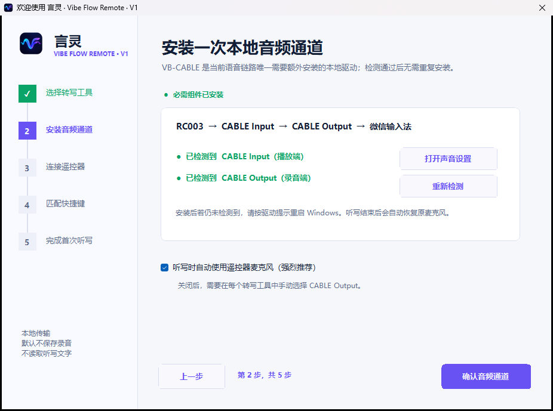

VB-CABLE 是当前版本唯一必须额外安装的本地驱动。

1. 打开 [VB-Audio 官方页面](https://vb-audio.com/Cable/)。
2. 下载 VB-CABLE Driver ZIP。
3. 在“下载”文件夹中右键 ZIP，选择“全部解压”。不要在压缩包预览窗口里直接运行。
4. 右键 `VBCABLE_Setup_x64.exe`，选择“以管理员身份运行”。
5. 点击 **Install Driver**。
6. 按安装提示重启 Windows。
7. 重新打开言灵，点击“重新检测”。

通过标准是同时看到：

- `CABLE Input（播放端）`：已检测到。
- `CABLE Output（录音端）`：已检测到。

建议保持“听写时自动使用遥控器麦克风”开启。言灵会在听写开始时临时让 Windows 使用 `CABLE Output`，结束并排空音频后恢复原来的麦克风。

不要从第三方下载站获取 VB-CABLE，也不要把它的安装包重新打包到本项目。驱动许可与发布由 VB-Audio 负责。

### 第三步：连接遥控器

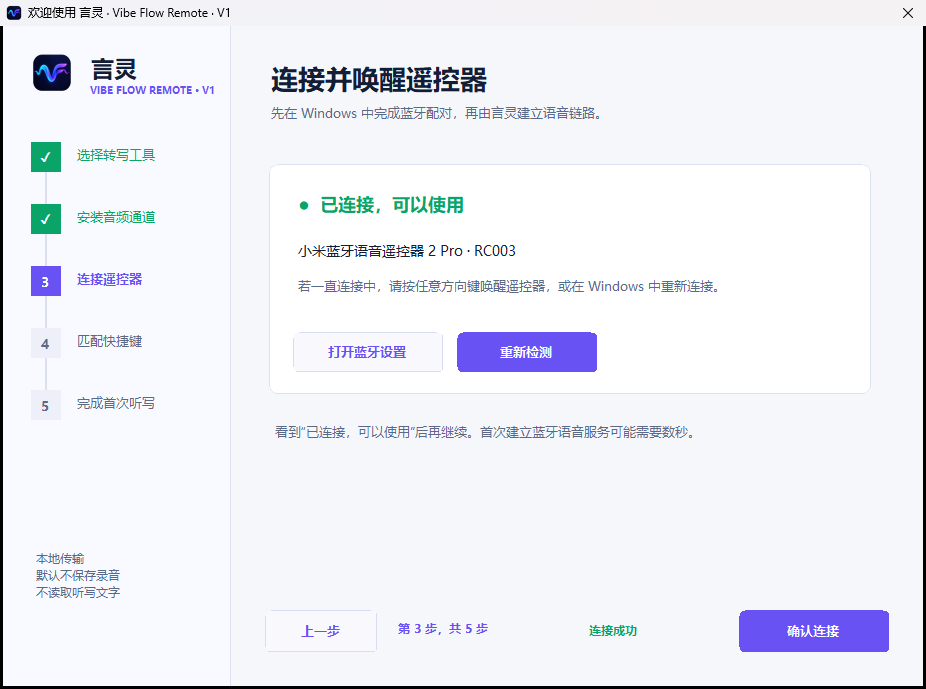

1. 打开 Windows **设置 > 蓝牙和设备**。
2. 让 RC003 进入配对状态。
3. 选择 `MI RC` 或“小米蓝牙语音遥控器”完成配对。
4. 回到言灵点击“开始检测”。
5. 若遥控器休眠，短按任意方向键唤醒。
6. 看到绿色“已连接，可以使用”后继续。

遥控器若仍连接电视或另一台电脑，先断开旧设备。首次建立 ATVV 语音服务可能需要数秒。

### 第四步：匹配快捷键

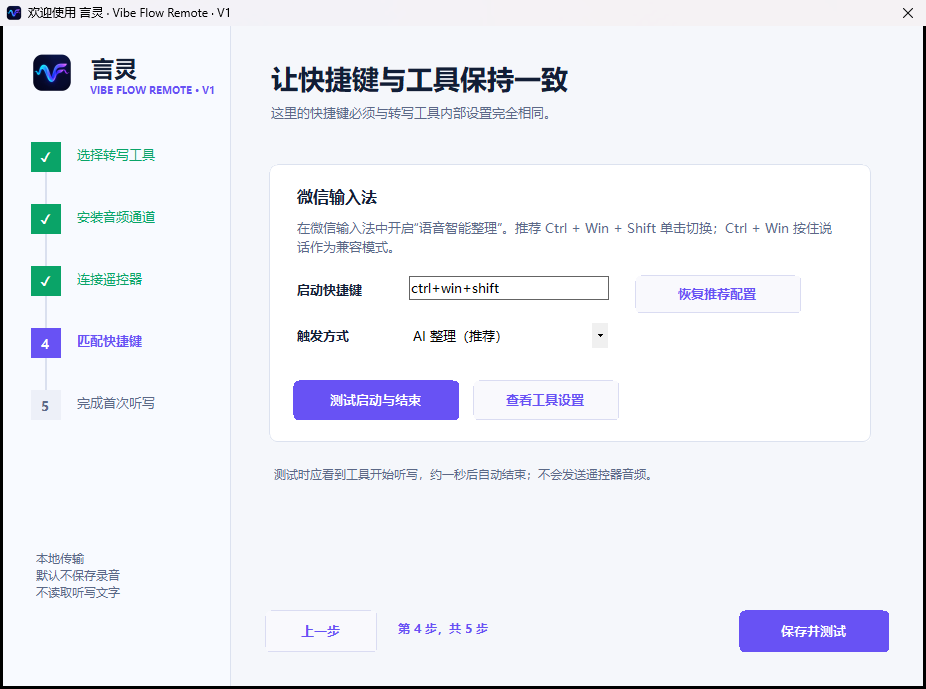

1. 在转写工具中确认全局快捷键。
2. 在言灵填写相同快捷键。
3. 选择“单击切换”或“按住触发”。
4. 点击“测试启动与结束”。
5. 确认工具开始听写，并在测试后结束。

这一步只测试转写工具控制，不发送遥控器音频。

### 第五步：完成首次听写

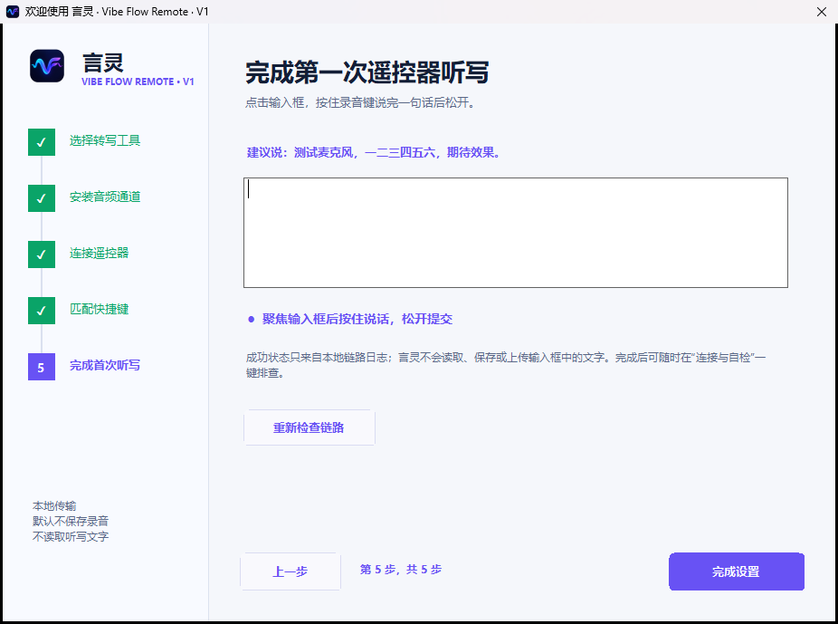

1. 点击空白测试输入框，确保光标闪烁。
2. **按住录音键**开始。
3. 说“测试麦克风，一二三四五六，期待效果”。
4. **松开录音键**结束，不要再按第二次。
5. 听到清晰、短促的结束音后，等待绿色“首次听写成功”。
6. 点击“完成设置”。

成功判断来自本地链路日志，言灵不会读取测试框里的文字。若未通过，不要反复点击“完成设置”，先按页面提示重新检查链路。

## 日常按住听写

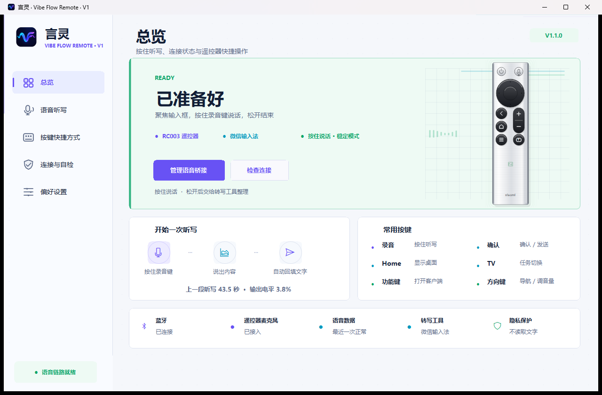

每次使用：

1. 点击 Codex、Cursor、聊天软件或其他应用中的输入框。
2. 按住录音键。首页遥控器麦克风出现紫色光效，并显示“正在听写”与计时。
3. 保持按住并自然说话。
4. 说完后松开录音键，不要再按第二次。
5. 青色表示正在排空并交给工具整理；绿色表示文字已经完成回填。结束提示音只在第 4 步播放，不会完成后再响一次。

按住模式的两项核心保证：

- **边界明确**：按下只负责开始，松开只负责结束；松开后不会自动重新打开麦克风。
- **有界收尾**：先等待 RC003 自然停止，只有停止控制包丢失时才执行一次兜底关闭。

RC003 会在持续长按约 60 秒时自行上报松开并停止 ATVV 音频。Windows 此后无法判断实体键是否仍被按住，也无法通过 `MIC_OPEN` 或 `MIC_EXTEND` 获得后续真实音频。因此稳定模式不承诺单次超过 60 秒；长内容请按自然段分次输入。短按启动的实验模式见 [连续听写专题](CONTINUOUS_DICTATION_ZH.md)。

完整边界与技术说明见 [连续听写专题](CONTINUOUS_DICTATION_ZH.md)。

## 两分钟验收

完成向导后，用以下步骤确认整条链路，而不只是确认页面能打开：

1. 首页显示绿色“已准备好”和“PUSH TO TALK”。
2. 按住录音键后，遥控器麦克风出现紫色光效并开始计时。
3. 持续说话 8 到 10 秒后松开，只出现一次微信麦克风。
4. 状态依次变为青色整理和绿色完成，文字直接进入原输入框。
5. 打开“连接与自检”，确认 7/7 通过；最近听写显示音频时长、零丢包和麦克风已恢复。

## 语音听写页面

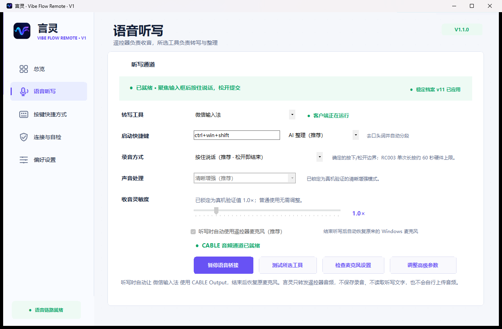

- **转写工具**：选择日常使用的识别与文字整理工具。
- **启动快捷键 / 触发方式**：必须与工具内部设置一致。
- **录音方式**：新安装和 schema 18 升级默认“按住说话”；按下开始、松开结束，单次约 60 秒硬件上限。连续听写仅作为短按启动的实验选项保留。
- **稳定档案 v11**：`1.0x`、清晰增强、`180 ms` 排空、自动路由均已真机验证。
- **高级参数**：普通用户不要调整。只有排查特殊设备时才解锁，偏离后可一键恢复稳定档案。
- **测试所选工具**：验证工具能否启动和结束，不验证 RC003 收音。

不要为了提高识别率直接拉高增益。过高增益会同时放大环境噪声和蓝牙编码噪声。

## 配置遥控器快捷键

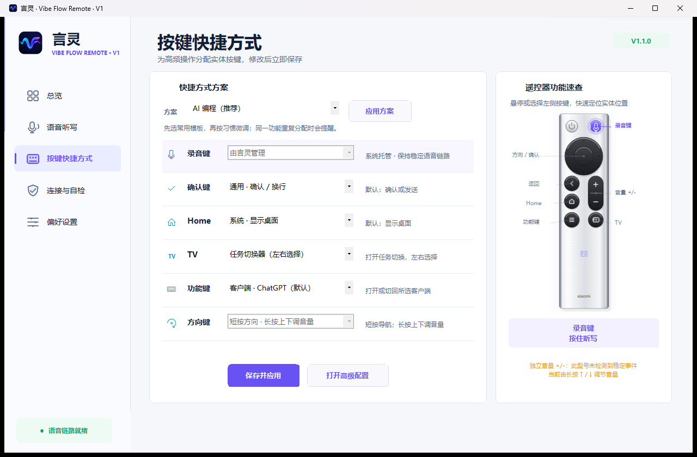

### 实体按键

| 遥控器按键 | 默认行为 | 可配置 |
| --- | --- | --- |
| 录音键 | 按住开始，松开结束；单次约 60 秒硬件上限 | 固定 |
| 确认键 | `Enter`，确认、发送或换行 | 是 |
| Home | `Win + D` 显示桌面 | 是 |
| TV | 打开任务切换器，左/右选择，确认进入 | 是 |
| 功能键 | 打开或切回 ChatGPT 客户端 | 是 |
| 方向键 | 短按原生方向；长按上/下调节系统音量 | 固定 |

右侧遥控器会高亮当前选择的实体位置。修改下拉选项后立即保存；点击“保存并应用”可确保后台桥接已经启动。

### 高频可选操作

| 分类 | 操作 |
| --- | --- |
| 编辑 | 复制、剪切、粘贴、撤销、重做、保存、全选 |
| 代码 | 命令面板、快速打开文件、新建终端、删除当前行、运行/调试 |
| 导航 | 查找、关闭标签页、切换标签页、切换应用、返回上一页、显示桌面 |
| 客户端 | ChatGPT、DeepSeek、Claude、Cursor、VS Code、Windsurf、Windows Terminal |
| 通用 | Enter、Esc |

如果两个可配置实体键使用同一个功能，言灵会保存配置并显示黄色提醒。重复分配并非错误，但通常意味着某个实体键被浪费。

### 硬件边界

已验证 RC003 的独立返回键和音量 +/- 键没有向 Windows 上报稳定的 Keyboard、Raw Input 或 Consumer HID 事件，因此本版不展示这些配置。系统音量请使用长按方向上/下。

功能键只支持单击操作，不作为组合键前缀。此前测试证明组合键上报不稳定，本版不宣传未验证功能。

## 连接与自检

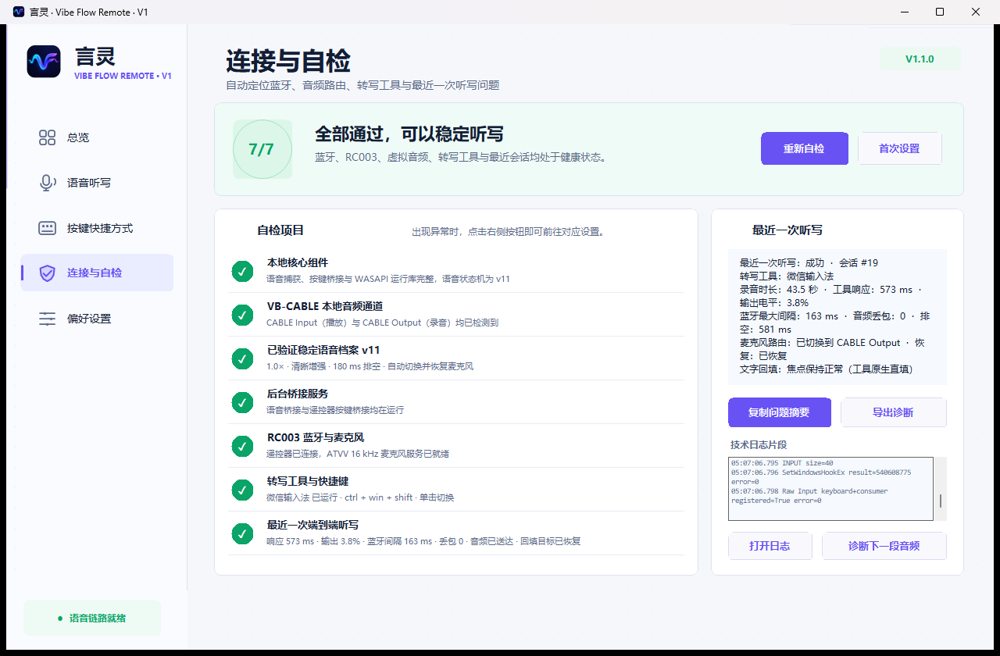

自检包含七项：

1. 本地核心组件。
2. VB-CABLE 两个端点。
3. 已验证稳定语音档案 v11。
4. 后台语音与按键桥接。
5. RC003 蓝牙和 ATVV 麦克风。
6. 转写工具与快捷键。
7. 最近一次端到端听写。

绿色表示通过，黄色表示需要确认，红色表示必须修复。异常项右侧会出现按钮，直接前往蓝牙、音频、转写工具或稳定参数页面。

稳定按住模式结束后，“最近一次听写”会显示本次音频时长、输出电平、丢包和麦克风恢复状态；实验连续模式还会显示逻辑总时长与分段数。

## 偏好设置

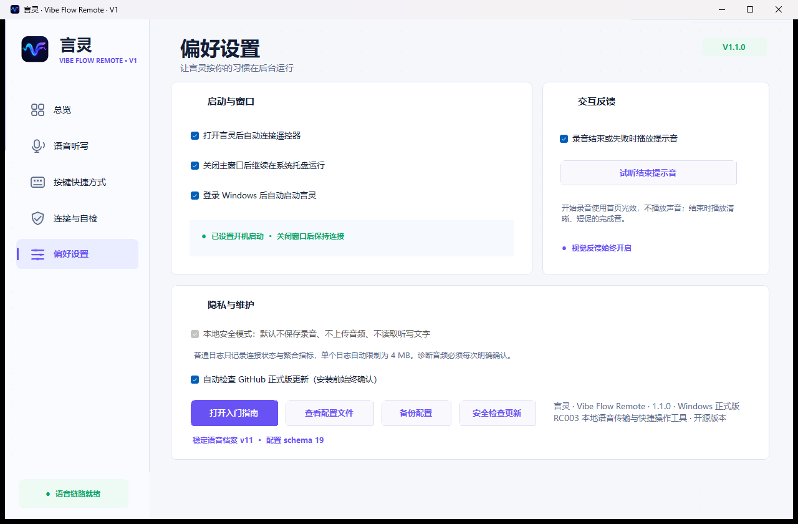

- **打开言灵后自动连接遥控器**：建议开启。
- **关闭主窗口后继续在托盘运行**：建议开启。
- **登录 Windows 后自动启动言灵**：按个人需要选择。
- **录音结束或失败时播放提示音**：默认开启；开始录音使用首页波纹光效且不播放声音，结束音可单独试听。
- **自动检查 GitHub 正式版更新**：默认开启，只读取版本信息；下载安装前始终询问。
- **打开入门指南**：重新进入五步向导，不会清空已有配置。
- **备份配置**：修改大量快捷键前可先备份。
- **安全检查更新**：在应用内比较版本，同时下载安装包与校验清单；SHA-256 不一致时不会运行文件。

## 导出安全诊断

遇到问题时：

1. 打开“连接与自检”。
2. 点击“重新自检”。
3. 点击“复制问题摘要”，粘贴到 GitHub Issue。
4. 若需要完整日志，再点击“导出诊断”。

普通日志和问题摘要不包含录音、识别文字、完整蓝牙地址或完整设备路径。

“诊断下一段音频”是例外：只有用户明确确认后，下一段、最长 30 秒音频才会保存在本机，用于判断问题位于蓝牙解码、声音处理、VB-CABLE 还是转写工具。完成后功能自动关闭。上传前必须自行试听并删除隐私内容。

## 按现象排查

| 现象 | 先检查 | 处理方法 |
| --- | --- | --- |
| 程序打不开 | 下载来源和 Windows 提示 | 只从 Releases 下载，核对 SHA-256 |
| 找不到 CABLE 端点 | 自检中的 VB-CABLE | 从官网安装、重启 Windows、重新自检 |
| 蓝牙已配对但一直连接中 | RC003 是否休眠或连接其他设备 | 按方向键唤醒；断开其他设备；必要时移除后重新配对 |
| 测试所选工具无反应 | 客户端、快捷键、触发方式 | 先用实体键盘测试，再让两边设置完全一致 |
| 测试工具正常但录音键无反应 | 后台桥接与 RC003/ATVV | 按自检按钮恢复服务，重新连接蓝牙 |
| 面板出现但没有文字 | 自动路由和 CABLE Output | 开启“自动使用遥控器麦克风” |
| 转写成功但提示“已复制文本” | 最近一次听写中的“文字回填” | 这表示微信没有识别到有效输入焦点；重新点击真实输入框后再试，若仍出现请复制问题摘要提交 Issue |
| 持续长按约 60 秒自动结束 | RC003 硬件边界 | 这是遥控器固件行为；按自然段分次输入，不要反复调节增益或蓝牙参数 |
| 松开后再次出现麦克风 | 录音方式和 schema | 选择“按住说话”，确认配置 schema 19，然后重启言灵并导出问题摘要 |
| 首字缺失或结束后才启动 | 工具响应和稳定档案 | 恢复稳定档案 v11，不修改 180 ms 启动与 180 ms 排空 |
| 声音小、漏字或错字多 | 输出电平、蓝牙间隔 | 保持 1.0x 和清晰增强，靠近麦克风；仍异常再做一次性诊断 |
| 录音时电脑音量自动降低 | 宿主日志中的 `WINDOWS AUDIO DUCKING PROTECTED` | 更新到当前版本并重启言灵；新版会在听写期间临时阻止 Windows 通信降音，结束后恢复原偏好 |
| 开机后第一次录音无反应 | 转写工具是否已启动 | 开启应用自启动；等待绿色就绪；运行自检 |
| 快捷键断开重连后丢失 | 是否运行旧目录或多实例 | 退出托盘旧实例，从当前版本入口启动，重新保存并应用 |
| 所有普通按键失效 | 后台桥接 | 从托盘退出重开，并确认诊断路径属于当前版本 |
| 独立返回或音量键无效 | 硬件边界 | 无需重复配置；音量使用长按方向上/下 |
| 更新后仍是旧界面 | 运行路径 | 退出旧实例，从开始菜单或新解压目录打开 |

### 工具能打开，但听不到遥控器

言灵向播放端 `CABLE Input` 写入声音，转写工具需要从对应录音端 `CABLE Output` 获取声音。建议一直开启自动路由。言灵在每次听写前临时切换 Windows 的三个默认录音角色，结束后恢复，并保留意外退出恢复标记。

### 录音时电脑音量自动降低

微信语音会创建 Windows 通信会话。Windows 默认可能在约 1 秒内压低其他播放声音，这不是遥控器增益或 CABLE 麦克风电平变化。当前版本会在遥控器唤醒阶段临时应用“通信时不降低其他声音”，通知 Windows 音频服务后再启动微信听写，并在结束后恢复原设置。

微信 AI 整理模式的正常日志应包含 `WINDOWS AUDIO DUCKING PROTECTED`、开始与结束各一次 `WETYPE HOTKEY TOGGLE`、`provider_action=second_tap`、`route_release_order=after_provider_stop`，以及 `WINDOWS AUDIO DUCKING PREFERENCE RESTORED`。恢复标记只在听写期间存在；若应用异常退出，下次启动会自动恢复。仍有问题时，可在 `mmsys.cpl` 的“通信”页手动选择“不执行任何操作”，然后导出诊断。

### 为什么按住模式约 60 秒结束

RC003 会在一次物理长按约 60 秒时同时发送 `F5 UP` 和 ATVV `stream_stop`。即使用户仍在按住，Windows 看到的状态也已经是“松开”，后续主机重开只能得到控制状态而没有真实音频。言灵因此不会在按住模式中自动重开，避免结束后弹出第二个麦克风。需要更长内容时请松开完成当前自然段，再按住开始下一段。

### 文字没有回到原输入框

开始录音前，先用鼠标点击最终要输入文字的位置。言灵通过 Windows UI Automation 记录网页、Chromium/Electron 客户端或原生程序中的真实编辑控件。录音期间只检查该焦点是否仍然有效，不会主动激活窗口或重新设置焦点。正常结果是微信输入法直接把文字写入原输入框。

微信路径不会读取或修改剪贴板，也不会发送 `Ctrl + V`。如果微信提示“已复制文本”，说明它在提交时没有识别到可直接输入的文字上下文，这不是正常完成状态。

若仍未直接回填：

1. 打开“连接与自检”，查看最近一次听写的“文字回填”。
2. 若显示“未记录输入目标”，确认录音前确实点击了可编辑输入框。
3. “焦点保持正常（工具原生直填）”表示微信可以直接写入。
4. 若显示“工具未能直接写入”，点击“复制问题摘要”后提交 Issue。
5. 管理员权限运行的目标程序可能阻止普通权限输入法写入；让目标程序与言灵、转写工具使用相同权限级别。

言灵不会读取转写文字，也不会通过剪贴板搬运识别结果。

### 识别质量差

先确认转写工具实际使用的是 `CABLE Output`，然后保持稳定档案 v11。靠近遥控器麦克风说固定短句，对比微信输入法和 Typeless。若两者都差，使用一次性音频诊断；若只有某个工具差，优先检查该工具的网络、语言和降噪设置。

### 更新或重连后快捷键恢复默认

配置保存在运行目录的 `vibe-mic-config.json`。不要从多个免安装目录交替运行，也不要删除此文件。正式发布包只带 `vibe-mic-config.default.json` 模板，覆盖升级不会替换已有配置。

### 应用内更新

“安全检查更新”只接受项目官方 GitHub HTTPS 下载地址。更新器会先验证 `VibeFlow-Setup.exe` 与同一 Release 的 `SHA256SUMS.txt`，再询问是否安装；配置文件不会被覆盖。GitHub API 限流时会自动改用官方最新版本重定向。

发布者签名和验证步骤见 [Windows 代码签名与安全更新](CODE_SIGNING_ZH.md)。

## 隐私与卸载

安装版可在 Windows **设置 > 应用 > 已安装的应用** 中卸载。免安装版先在“偏好设置”关闭开机启动，从系统托盘退出言灵，再删除解压目录。

VB-CABLE 是独立驱动。只有不再使用任何虚拟麦克风工具时，才建议单独卸载。

## 获取帮助

先运行自检并准备问题摘要，再提交 [GitHub Issue](https://github.com/richlearntodo-debug/vibe-flow/issues)。也可以扫码加入 Vibe Flow 用户社区：


## 教程截图复用

本教程截图位于 [`docs/images`](images)，主页面为 1280 x 840。维护者可在本地构建并启动应用后运行：

```powershell
powershell -ExecutionPolicy Bypass -File .\scripts\capture-ui-screenshots.ps1 -CaptureFullOnboarding
```

发布前必须逐张检查：版本号、按住/松开文案、文字截断、控件重叠、真实连接状态和隐私信息。
