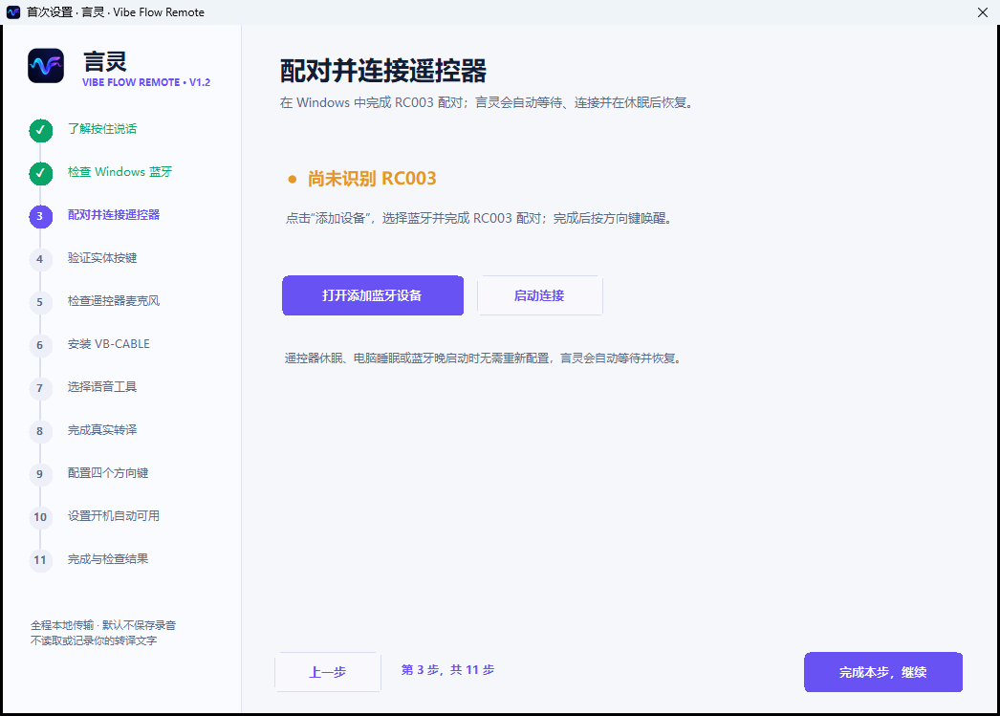
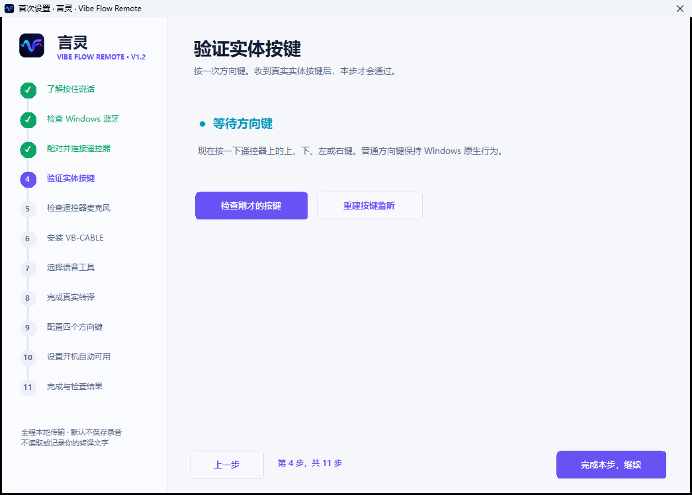
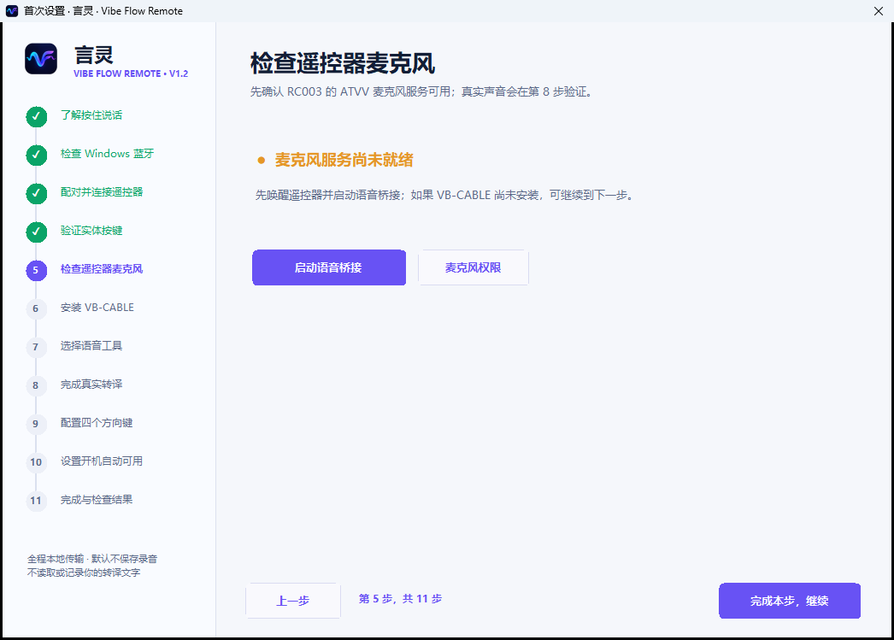
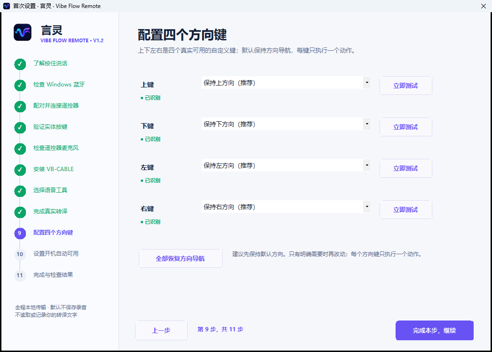
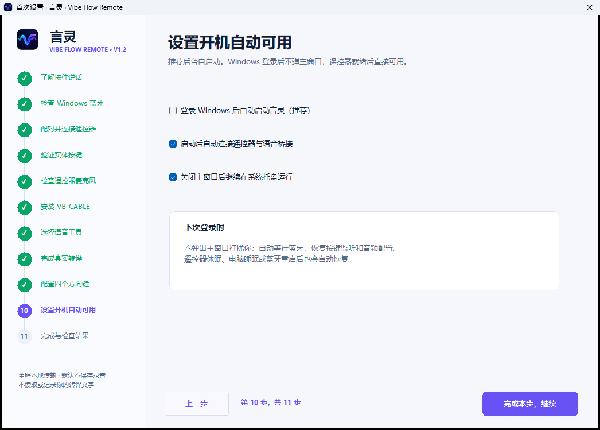
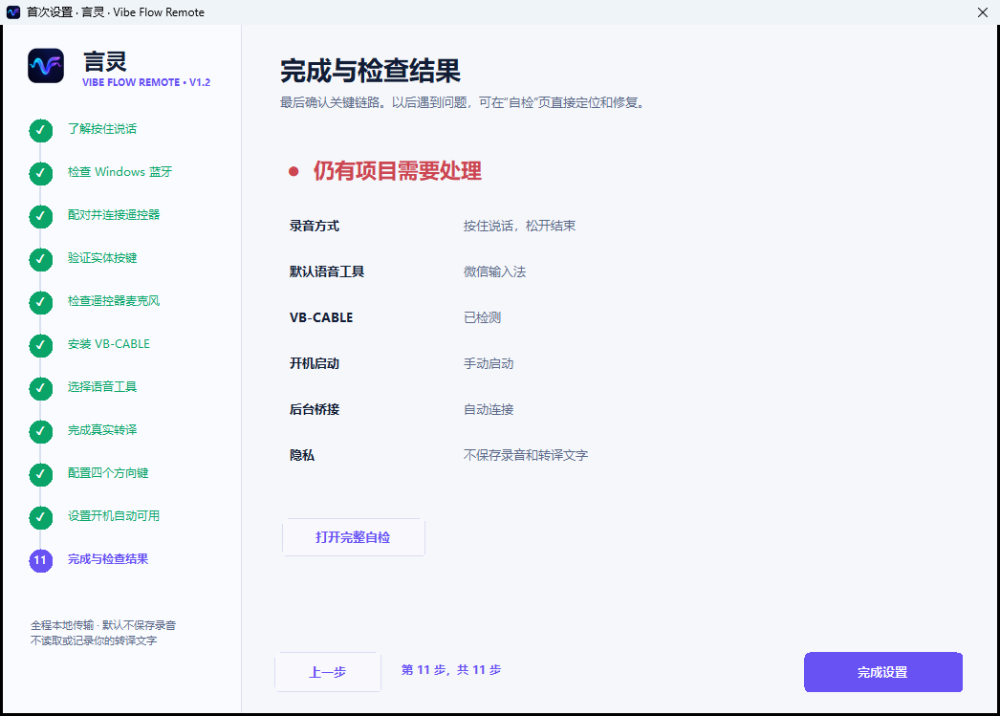

# 言灵 · Vibe Flow Remote v1.2.1 使用教程

本教程面向第一次使用蓝牙语音遥控器的 Windows 用户。完成一次设置后，日常只需要：**单击输入框，按住录音键说话，松开结束，确认文字后发送。**

## 先加入用户社区

遇到遥控器型号、蓝牙、VB-CABLE 或输入法版本差异时，可扫码交流。二维码放在教程步骤前，方便在设置过程中随时找到。


## 准备清单

- Windows 10 或 Windows 11，64 位。
- 小米 RC003 / MI RC 蓝牙语音遥控器。
- 可用的 Bluetooth LE 适配器。
- 微信输入法、Typeless、豆包输入法、Windows 语音输入或其他支持全局快捷键的工具。
- VB-CABLE 虚拟音频驱动。

推荐下载 [v1.2.1 `VibeFlow-Setup.exe`](https://github.com/richlearntodo-debug/vibe-flow/releases/download/v1.2.1/VibeFlow-Setup.exe)。免安装包必须完整解压后再运行。不要把源码 ZIP 当作应用。[所有版本固定下载入口](VERSION_ARCHIVE_ZH.md)。

## 工作方式

```text
遥控器声音 -> Bluetooth ATVV -> 言灵
  -> CABLE Input -> CABLE Output
  -> 语音工具 -> 当前聚焦的文本输入框
```

言灵只负责音频和快捷键控制，不做语音识别、不读取转译文字、不保存普通录音，也不通过剪贴板或 `Ctrl + V` 回填文字。

## 首次设置 11 步

向导会保存进度。安装 VB-CABLE 需要重启时，重新登录后会回到对应步骤。

### 第 1 步：了解按住说话


记住一个固定流程：聚焦输入框 -> 按住说话 -> 松开结束 -> 检查文字 -> 确认发送。

### 第 2 步：检查 Windows 蓝牙


确认蓝牙开关已开启。若页面显示未开启，点击按钮进入 Windows 蓝牙设置，修复后返回言灵，页面会重新检测。

### 第 3 步：配对遥控器



1. 唤醒 RC003。
2. 在 Windows 中选择“添加设备”。
3. 选择蓝牙，并完成 `MI RC` / RC003 配对。
4. 返回言灵并点击重新检测。

蓝牙显示“已配对”不等于语音链路已经完成，后续步骤还会验证真实按键和音频。

### 第 4 步：验证按键



按一次上、下、左或右。页面必须显示收到真实遥控器事件。若没有，先唤醒遥控器，再点击“重建按键监听”。

### 第 5 步：检查遥控器麦克风



此步检查 RC003 ATVV 服务和 Windows 麦克风权限。最终声音质量在第 8 步用真实转译确认。

### 第 6 步：安装 VB-CABLE


1. 点击“安装官方 VB-CABLE”。
2. 言灵从 VB-Audio 官方地址下载并校验文件。
3. Windows 请求管理员权限时确认。
4. 按安装程序提示完成；若要求重启，直接重启。
5. 回到向导后确认两端都已检测：

- `CABLE Input`：言灵写入声音的播放端。
- `CABLE Output`：语音工具读取声音的录音端。

VB-CABLE 是当前 Windows 音频链路必须的本地驱动，但不包含在项目安装包中。

### 第 7 步：选择语音工具


选择一个全局默认工具。言灵中的快捷键必须与工具设置完全一致。

| 工具 | 推荐起点 | 注意事项 |
| --- | --- | --- |
| 微信输入法 | `Ctrl + Win`、单击切换 | v1.2.1 默认稳定档案，启动等待 `80 ms` |
| Typeless | 常见 `Right Alt` | 以当前客户端显示为准 |
| 豆包输入法 | 客户端全局语音快捷键 | 两边逐键核对 |
| Windows 语音输入 | `Win + H` | 首次可先手动触发一次完成系统初始化 |
| 其他语音工具 | 工具自己的全局快捷键 | 必须能从快捷键开始和结束 |

### 第 8 步：完成真实转译


1. 单击内置测试文本框，确认插入光标出现。
2. 按住遥控器录音键。
3. 看到真实收音反馈后说：“测试麦克风，一二三四五六，期待效果。”
4. 松开录音键。
5. 等待文字直接出现在测试框。
6. 点击“检查测试结果”。

若只把鼠标放在文本框上而没有单击，文本框不一定获得键盘焦点。所选语音工具会把结果写入当时的系统焦点，因此开始前必须确认目标框内有插入光标。

### 第 9 步：配置四个方向键



上、下、左、右默认保持标准方向。每个方向只配置一个动作：

1. 选择方向。
2. 按实体键验证高亮。
3. 从下拉列表选择已验证动作。
4. 点击“立即测试”。
5. 保存，或恢复原方向。

新增“系统 · 区域截图”：选择后该方向键会发送 `Win + Shift + S`。Windows 显示截图选区即表示成功。


这里不提供本机程序浏览、网址启动和任意命令。开机、返回及独立音量按键也不进入映射层。

### 第 10 步：设置开机自动可用



按需要选择：

- 登录 Windows 后自动启动；
- 启动后自动连接遥控器；
- 关闭窗口后留在系统托盘。

应用会保存选择。后台启动不会主动弹出主窗口。

### 第 11 步：查看汇总



全部通过后完成设置。若有橙色或红色项目，打开完整自检并从第一项异常开始处理，不需要重做前面的步骤。

## 日常听写


1. 单击 ChatGPT、Codex、Claude、DeepSeek、浏览器或其他软件的文本输入框。
2. 确认插入光标可见。
3. 按住录音键并自然说话。
4. 松开；等待一次结束提示音。
5. 等待语音工具完成识别和整理。
6. 检查文字，按中间确认键发送。

当前稳定模式单段最长约 `60 秒`。到达 RC003 物理边界时会结束当前段，不会自动开启第二个麦克风。长内容请分段输入。

开始录音不播放提示音，以首页状态、遥控器录音键高亮和真实波纹反馈；结束播放一次短提示音。没有真实音频时波形不动。

## 快捷键页面


左侧遥控器显示真实按键反馈。右侧按方向盘位置排列四个选择按钮，当前方向的设置在下方显示。

可选动作包括原生方向、复制、剪切、粘贴、撤销、重做、保存、全选、查找、确认、取消、Tab、上一页/下一页、区域截图和显示桌面。这些都是标准 Windows 键盘动作。

### 默认按键

| 实体按键 | 默认功能 | 可配置 |
| --- | --- | --- |
| 录音键 | 按住收音，松开结束 | 固定 |
| 功能键 | 短按复制，长按粘贴 | 固定 |
| 上 / 下 / 左 / 右 | 标准方向 | 分别配置一个动作或区域截图 |
| 中间确认键 | `Enter` | 固定 |
| Home | `Win + D` | 固定 |
| TV | 打开 Windows 任务视图 | 固定 |

TV 打开任务视图后，上下左右用于移动选择，中间确认键进入，再按 TV 关闭。此时方向键不会执行用户设置的普通动作。

## 主题


- 白天模式：默认，沿用早期版本的白色页面和清晰层级。
- 夜间模式：中性深灰、低饱和强调色，适合暗环境。
- 在“设置”页点击“白天模式”或“夜间模式”按钮后立即切换，不需要重启言灵。

主题只改变视觉，不改变录音、音频和按键参数。

## 一键自检


自检包含 10 项：

1. 核心组件与单实例。
2. Windows 蓝牙。
3. RC003 配对与连接。
4. 按键监听。
5. 真实遥控器音频。
6. VB-CABLE。
7. 稳定语音参数。
8. 默认语音工具与快捷键。
9. Windows 自启动。
10. 完整音频与转译会话。

每项显示正确状态、当前状态、具体原因、下一步和修复入口。绿色表示正常，蓝色表示检测中，橙色表示待配置，红色表示错误，灰色表示当前设备不支持。

## 按现象排查

| 现象 | 先检查 | 处理方法 |
| --- | --- | --- |
| 按录音键无反应 | 按键监听、桥接进程、RC003 是否休眠 | 唤醒遥控器，重建监听，再按方向键和录音键 |
| 松开后才弹出麦克风 | 当前组件版本、运行目录、日志中的 `recording_kernel=v1.0.3` | 退出其他便携版，只运行完整 v1.2.1 |
| 松开后出现第二个麦克风 | 是否同时运行多个版本、重复 DOWN/UP 计数 | 结束旧目录进程并导出诊断；不要继续点击 |
| 松开后不结束 | 是否收到真实 UP 和 `REMOTE STREAM STOP SIGNAL` | 唤醒并重连遥控器，重建按键监听，确认没有旧版本进程 |
| 只显示已复制 | 目标框是否真正获得键盘焦点 | 单击文本框看到插入光标后再按住录音 |
| 有面板但无文字 | VB-CABLE 两端、工具快捷键、工具麦克风权限 | 重新检测音频端点，并在工具内核对快捷键 |
| 轻声识别差 | 输出 RMS、稳定档案、说话距离 | 恢复稳定参数，靠近遥控器自然说话 |
| 到 60 秒自动结束 | RC003 物理边界 | 属于当前稳定行为；开始下一段 |
| 区域截图无反应 | 方向键动作和 Windows 截图工具 | 在快捷键页立即测试 `Win + Shift + S`，再保存应用 |
| TV 只闪一下 | 按键桥接版本是否为 1.2.1 | 重启按键桥接；TV 应打开持久任务视图 |
| 蓝牙重连后配置变化 | 配置 schema、当前运行目录 | 保留一个版本运行，检查配置备份并重新自检 |

## 日志与隐私

普通日志记录连接状态、会话边界、音频时长、电平、队列、路由和错误，不记录转译文字或普通会话音频。日志会自动轮转。

“诊断下一段音频”必须由用户确认，只保存下一次最长 30 秒的本地 WAV。排查结束后可删除。导出诊断会隐藏完整蓝牙地址和设备路径。

## 版本验收基线

自动测试不能替代真实 RC003：

1. 连续 100 次按住/松开，每次只有一个开始和一个结束。
2. 测试 10 秒、30 秒和约 60 秒，提前松开立即结束。
3. 全程无第二个麦克风会话。
4. 聚焦输入框时由语音工具直接写入文字，全程不经过剪贴板。
5. TV 任务视图持续显示，四方向和确认键有效。
6. 四方向自定义保存后，应用重启和蓝牙重连不丢失。
7. 蓝牙断开重连、Windows 睡眠唤醒和解锁后恢复。
8. 10 项自检与修复入口逐一核对。
9. 确认稳定参数仍为 `1.0 / speech / 180 ms / CABLE Input`。
10. 确认测试没有覆盖当前已安装的稳定版本。

正式发布资产必须同时通过自动测试、上述真机流程、安装包校验和版本固定下载检查。
