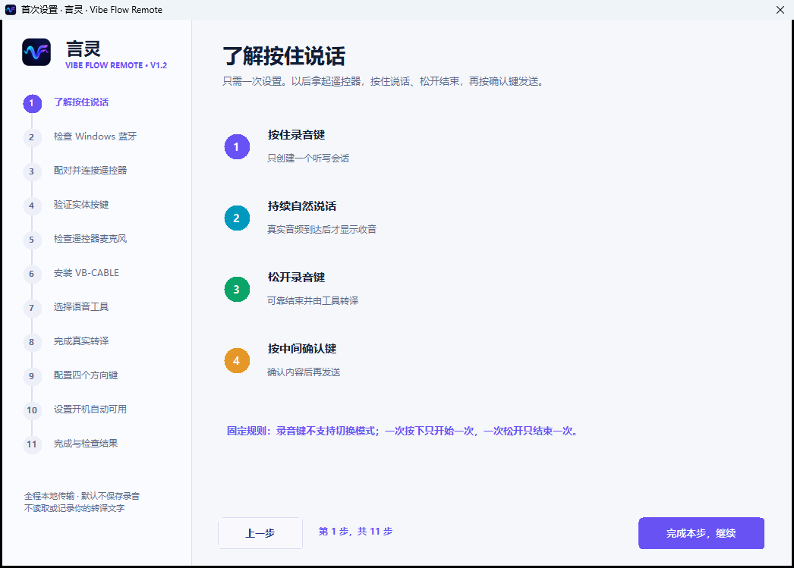
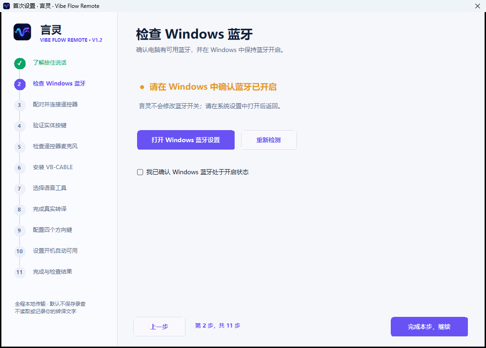
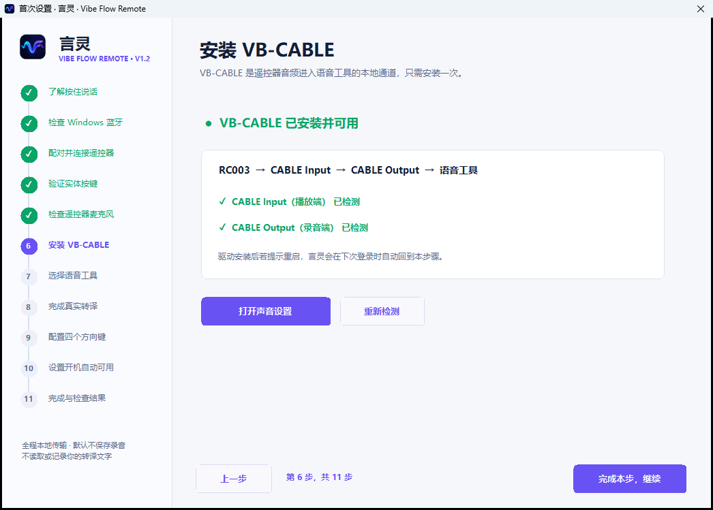
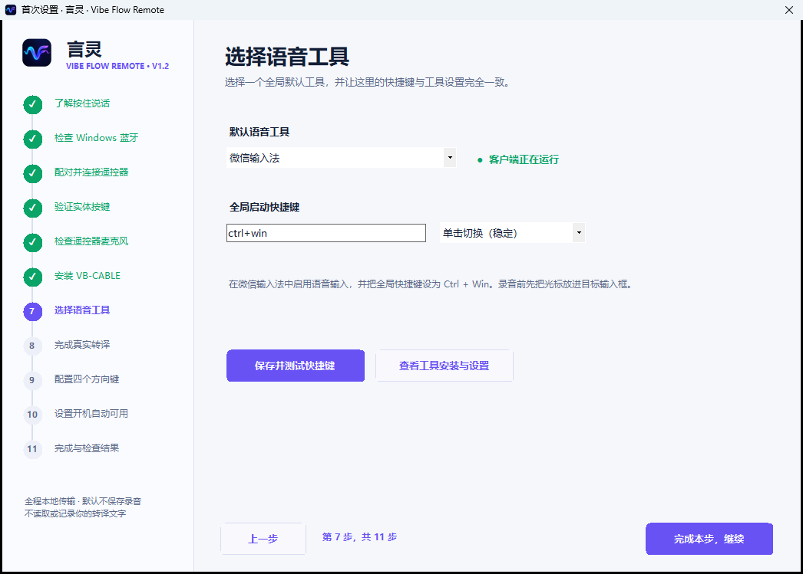
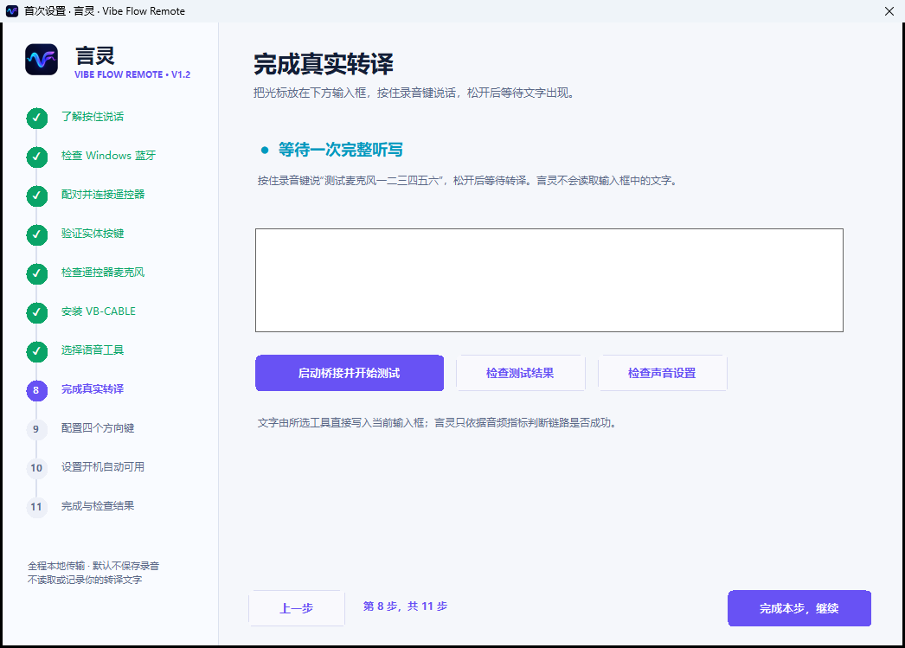

# 言灵 · Vibe Flow Remote v1.2.1 使用教程

`v1.2.1` 是用户友好稳定版：保留已经验证稳定的录音参数和常用按键，删除长录音续接、开机键、返回键和独立音量键等不稳定能力，并为四个方向键增加 Windows 区域截图。

## 下载

| 文件 | 用途 | 下载 |
| --- | --- | --- |
| `VibeFlow-Setup.exe` | 推荐给普通用户 | [直接下载](https://github.com/richlearntodo-debug/vibe-flow/releases/download/v1.2.1/VibeFlow-Setup.exe) |
| `Vibe-Flow-Windows-x64.zip` | 免安装版 | [直接下载](https://github.com/richlearntodo-debug/vibe-flow/releases/download/v1.2.1/Vibe-Flow-Windows-x64.zip) |
| `SHA256SUMS.txt` | 文件完整性校验 | [查看校验](https://github.com/richlearntodo-debug/vibe-flow/releases/download/v1.2.1/SHA256SUMS.txt) |

GitHub 页面底部的 `Source code (zip)` 不是 Windows 安装程序。

## 用户社区

安装、配对或转译工具配置遇到问题，可扫码加入用户社区。

## 这个版本能做什么

- 按住 RC003 录音键说话，松开结束，单段最长约 60 秒。
- 把遥控器音频交给微信输入法、Typeless、豆包输入法、Windows 语音输入或其他快捷键工具。
- 转译结果由语音工具直接写入当前输入框，检查后按中间确认键发送。
- 功能键短按复制、长按粘贴；Home 显示桌面；TV 打开 Windows 任务视图。
- 上、下、左、右可分别配置一个动作，包括区域截图 `Win + Shift + S`。
- 提供 11 步首次设置、10 项自检、白天/夜间主题和隐私安全日志。

## 使用前准备

1. Windows 10/11 x64 电脑，蓝牙工作正常。
2. 小米 RC003 / MI RC 遥控器，并已在 Windows 蓝牙中配对。
3. 安装一个日常使用的语音转译工具。
4. 从 [VB-Audio 官网](https://vb-audio.com/Cable/) 安装 VB-CABLE；安装后重启 Windows。
5. 在 Windows 声音设备中确认同时存在 `CABLE Input` 和 `CABLE Output`。

VB-CABLE 不包含在言灵安装包中。请只从 VB-Audio 官网下载，首次向导也提供检测与安装入口。

## 首次设置 11 步

安装后打开言灵，按照页面从上到下完成：

1. 了解“按住说话、松开结束、确认发送”。
2. 检查 Windows 蓝牙。
3. 配对并连接 RC003。
4. 按方向键验证按键链路。
5. 检查遥控器麦克风服务。
6. 安装并检测 VB-CABLE。
7. 选择默认语音工具，核对全局快捷键。
8. 在内置输入框完成一次真实转译。
9. 保持或配置四个方向键。
10. 选择是否随 Windows 启动。
11. 查看汇总；异常项进入“一键自检”。

### 蓝牙与遥控器

在 Windows 设置中选择“添加设备 -> 蓝牙”，唤醒遥控器并选择 `MI RC` 或 RC003。配对后回到言灵，应用会继续检测，不需要重新开始教程。

### VB-CABLE

检测通过时应看到：

- 言灵播放到 `CABLE Input`；
- 微信输入法等工具从 `CABLE Output` 收音；
- 自动使用遥控器麦克风处于开启状态。

### 选择语音工具

| 工具 | 推荐起点 | 注意事项 |
| --- | --- | --- |
| 微信输入法 | `Ctrl + Win`，单击切换 | 言灵和微信输入法必须完全一致。 |
| Typeless | 常见为 `Right Alt` | 以客户端当前全局快捷键为准。 |
| 豆包输入法 | 客户端语音快捷键 | 先在豆包中启用全局快捷键。 |
| Windows 语音输入 | `Win + H` | 使用 Windows 自带识别。 |
| 其他工具 | 自定义全局快捷键 | 必须支持快捷键开始和结束。 |

### 完成真实听写

1. 单击测试输入框，确认插入光标可见。
2. 按住遥控器录音键说一句完整的话。
3. 松开，等待一次结束提示音和转译结果。
4. 文字出现后完成本步。

## 日常听写

1. 单击 ChatGPT、Codex、Claude、DeepSeek、浏览器或其他软件的文本输入框。
2. 按住录音键并说话。
3. 松开录音键，等待语音工具转译。
4. 检查文字，按中间确认键发送。

当前单段最长约 60 秒。需要输入更长内容时，请按自然段分次录入。言灵不会自动续接，也不会创建第二个麦克风会话。

## 把方向键配置为截图

1. 打开左侧“快捷键”。
2. 选择上、下、左或右中的一个方向。
3. 在“执行动作”中选择“系统 · 区域截图”。
4. 点击“立即测试”；Windows 应显示截图选区。
5. 点击“保存并应用”。

配置后，该方向键在普通页面中不再执行原方向，而是发送 `Win + Shift + S`。需要恢复时点击“恢复方向导航”。TV 任务视图打开期间，四个方向仍优先用于选择程序，不会误触截图。

## 默认按键

| 按键 | 默认功能 |
| --- | --- |
| 录音键 | 按住收音，松开结束，约 60 秒上限 |
| 功能键 | 短按复制，长按粘贴 |
| 上 / 下 / 左 / 右 | 标准方向；可分别配置一个动作或区域截图 |
| 中间确认键 | `Enter`，确认或发送 |
| Home | `Win + D`，显示桌面 |
| TV | 打开持久任务视图；方向选择，确认进入 |

开机键、返回键和独立音量键没有稳定的 Windows 按键报告，因此本版不显示、不映射，也不宣传这些功能。

## 一键自检

自检覆盖核心组件、蓝牙、遥控器、按键、真实音频、VB-CABLE、稳定参数、语音工具、自启动和完整会话。优先处理第一张红色或橙色卡片，点击卡片可进入相应 Windows 设置或应用页面。

## 常见问题

| 现象 | 处理方法 |
| --- | --- |
| 录音键无反应 | 唤醒遥控器，确认只运行一个 Vibe Flow，再运行一键自检。 |
| 松开后出现第二个麦克风 | 退出其他安装版或便携版；日志应显示 `recording_kernel=v1.0.3`。 |
| 有声音但没有文字 | 核对语音工具快捷键，以及工具麦克风是否为 `CABLE Output`。 |
| 文字进入错误窗口 | 开始前单击目标输入框并确认插入光标可见。 |
| 到约 60 秒自动结束 | 这是当前稳定边界，请开始下一段。 |
| 截图没有打开 | 在快捷键页点击“立即测试”，确认 Windows 截图工具未被系统策略禁用。 |
| 蓝牙重连后设置变化 | 确认没有同时运行旧目录程序，再检查配置备份和当前版本。 |

普通日志不保存转译文字或日常录音。只有用户明确确认“诊断下一段音频”时，才会在本机保存下一次最长 30 秒的诊断 WAV。

全部历史版本及固定 EXE 下载入口见 [版本下载页](VERSION_ARCHIVE_ZH.md)。
