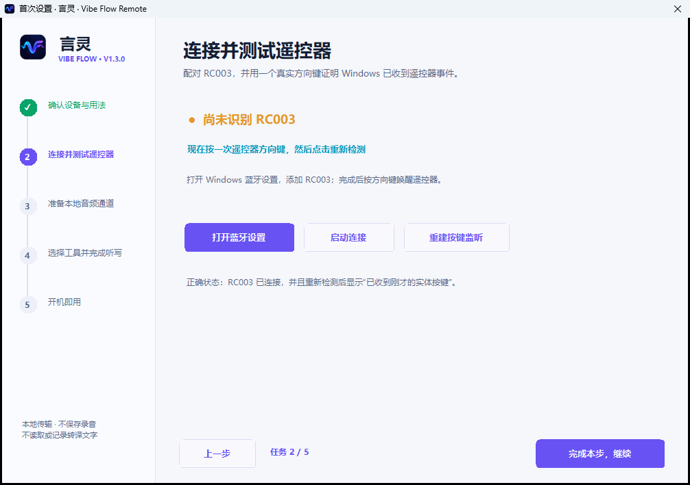
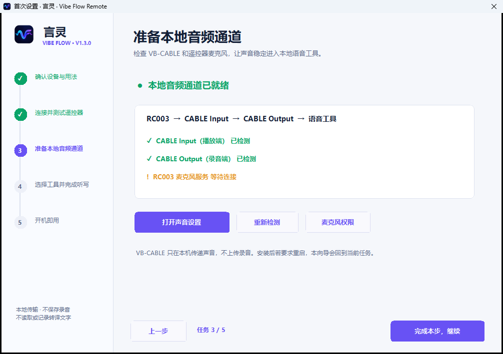

# 言灵 · Vibe Flow Remote v1.3 候选版教程

> v1.3 目前用于真机验收，不替代稳定版 v1.2.1。录音保持同一套稳定参数：按住说话、松开结束、单段约 60 秒。

## 使用前准备

- Windows 10/11 x64。
- 小米 RC003 / MI RC 蓝牙语音遥控器。
- Windows Bluetooth LE。
- VB-CABLE 本地虚拟音频驱动。
- 微信输入法、Typeless、豆包输入法、Windows 语音输入或其他支持全局快捷键的本地工具。

言灵不做云端转写，也不读取或保存听写文字。链路如下：

```text
RC003 麦克风 -> Bluetooth ATVV -> 言灵 -> CABLE Input
  -> CABLE Output -> 所选语音工具 -> 当前聚焦输入框
```

## 五项首次设置

设置进度会自动保存。安装 VB-CABLE 需要重启时，重新登录 Windows 后会继续对应任务。

### 任务 1：确认设备与用法


确认当前是 Windows 10/11 和 RC003。固定操作只有一套：聚焦输入框，按住录音键说话，松开结束，检查文字，再按确认键发送。

### 任务 2：连接并测试遥控器



1. 打开 Windows 蓝牙设置。
2. 配对 `MI RC` / RC003。
3. 返回言灵后按一次上、下、左或右。
4. 页面必须显示收到新的实体遥控器事件。

仅显示“已配对”还不够；这一项会验证 Windows 确实收到了按键。

### 任务 3：准备本地音频通道



确认系统中同时存在：

- `CABLE Input`：言灵写入遥控器声音的播放端。
- `CABLE Output`：语音工具读取声音的录音端。

缺少时使用页面中的官方安装入口。言灵会校验下载文件和签名；驱动安装需要 Windows 管理员确认，主程序本身不要求管理员运行。

### 任务 4：选择工具并完成听写


| 工具 | 推荐起点 | 触发方式 |
| --- | --- | --- |
| 微信输入法 | `Ctrl + Win` | 单击切换 |
| Typeless | 以客户端当前设置为准，常见为 `Right Alt` | 以客户端为准 |
| 豆包输入法 | 客户端全局语音快捷键 | 以客户端为准 |
| Windows 语音输入 | `Win + H` | 系统行为 |
| 其他工具 | 自定义全局快捷键 | 必须能开始和结束 |

先单击测试输入框，看到插入光标，再按住遥控器录音键说话。松开后，文字必须由语音工具直接进入测试框；言灵没有剪贴板回填路径。

如需微信的 AI 整理，请先在微信输入法内部选择对应语音模式。言灵只负责遥控器音频和快捷键触发，不会自行开启、模拟或宣称完成微信的润色。

### 任务 5：开机即用


选择是否登录 Windows 后自动启动、打开后自动连接，以及关闭窗口后留在托盘。完成后查看汇总；异常项可直接进入“一键自检”。

## 日常使用

1. 单击 ChatGPT、Codex、Cursor、VS Code、浏览器或其他应用的文本框。
2. 确认插入光标可见。
3. 按住遥控器录音键并自然说话。
4. 松开，等待一次结束提示音和工具转写。
5. 检查文字，按中间确认键发送。

单段达到 RC003 约 60 秒物理边界时会结束，不会自动建立第二个麦克风。长内容请分段输入。

## 快捷键


| 实体按键 | 默认动作 | 可配置 |
| --- | --- | --- |
| 录音键 | 按住收音、松开结束 | 固定 |
| 上/下/左/右 | 标准方向 | 单击动作 |
| 确认键 | `Enter` | 单击动作 |
| Home | 显示桌面 | 短按、长按 |
| TV | Windows 任务视图 | 单击动作 |
| 功能键 | 复制 / 粘贴 | 短按、长按 |

开机、返回和独立音量键没有稳定 Windows 输入报告，不显示配置入口。

从旧候选版升级时，如果开机键曾绑定 APP 或网页，且 `Home 长按`仍为空，新版会自动把该动作迁移到 `Home 长按`。开机键本身不会继续生效。

### 打开本机 APP

1. 点击要配置的按键卡。
2. 选择“打开或切换本机应用”。
3. 在“正在运行”或“已安装”中搜索；也可以浏览 EXE。
4. 选择后点击播放图标立即测试。
5. 看到“测试成功”后，再按实体遥控器验证。

执行顺序为：切换已经运行的窗口 -> 启动有效 EXE -> 使用 Windows 开始菜单 AppID。旧路径失效时，只要应用正在运行或有开始菜单入口，仍可恢复。

### 三套简单方案

- 通用导航：四方向保持原生方向，TV 打开任务视图。
- Vibe Coding：撤销、重做、复制、粘贴，TV 打开任务视图。
- 媒体控制：上/下调音量，左右保持方向，TV 播放/暂停。

方案只填充已验证动作，应用后仍可逐键调整。没有双击、宏或自动 Profile。

## 配置备份与恢复


- “备份配置”：导出 JSON。
- “导入配置”：导入旧电脑或其他安装的设置。
- “恢复上次”：回到最近一次原子备份。
- 导入时会迁移旧 schema，并强制保留稳定语音档案，避免旧参数破坏收音。

用户配置统一保存在 `%LOCALAPPDATA%\Vibe Flow Remote\UserData`。升级、移动安装目录或改用 ZIP 时会继续读取同一份设置；首次运行 v1.3 会自动迁移当前旧版目录中的有效配置。

设置页支持白天模式、夜间模式和跟随 Windows，切换主题不会重启录音或按键服务。

## 一键自检


自检覆盖组件与单实例、蓝牙、RC003、真实按键、真实动作、真实音频、VB-CABLE、稳定参数、语音工具、自启动，以及“音频与语音工具唤起”会话。按键项会区分“收到 RC003 设备事件”和“映射动作真正进入执行器”，每项显示正确状态、当前状态、原因、下一步和修复入口。

言灵不会读取第三方输入框，因此自动自检不能证明最终文字内容或 AI 润色质量。首次教程会要求你在测试框中明确确认文字已经出现；测试文字只用于当前页面，不写入日志或配置。

自检不是只有“通过/失败”两种结果：首次打开蓝牙项短暂显示蓝色“正在检测”属于正常；Bridge 刚启动时，按一次实体遥控器按键即可完成真实按键验证；如果你主动选择不开机自启动，该项会显示橙色“需要配置”，不会影响当前会话使用。只有红色项目才表示当前功能发生错误。

诊断导出不包含录音和听写文字，并会隐藏用户目录、电脑名、设备路径、蓝牙地址、网址和应用目标。诊断音频必须由用户明确确认，只采集下一段且最长 30 秒。

## 常见问题

| 现象 | 处理 |
| --- | --- |
| 选择 APP 后实体键无反应 | 播放图标只验证动作执行器。再按实体键并打开自检，确认 `raw_action_edges` 增加；若只增加设备事件，重建按键监听并重新保存。APP 只能绑定到方向、Home、TV 或功能键。 |
| APP 已安装但路径失效 | 在 APP 选择器重新搜索；新动作会同时保存进程、EXE 和开始菜单兜底。 |
| 普通键盘按键触发遥控器动作 | 当前版本不应发生。运行一键自检确认路由来源为 Raw Input 或设备过滤器，并确认没有旧目录中的桥接进程。 |
| 遥控器动作执行时原始方向/Home/菜单效果也发生 | 自检显示“Raw Input 安全直通”时属于用户态边界；普通键盘不受影响。无副作用精确拦截需要通过发布门禁的 Microsoft 签名设备过滤器。 |
| 按录音键无反应 | 唤醒 RC003，检查按键监听、ATVV 和语音工具快捷键。 |
| 有麦克风面板但没有文字 | 检查 `CABLE Output`、工具快捷键和目标输入框焦点。 |
| 到 60 秒自动结束 | 当前 RC003 稳定物理边界；开始下一段。 |
| 重连后配置变化 | 确认只运行一个安装目录；使用“恢复上次”或导入备份，再运行自检。 |

## 发布门禁

v1.3 正式发布前仍需完成：100 次实体录音按下/松开、所有公开按键逐项执行并核对动作计数、普通键盘冲突、蓝牙断开重连、遥控器休眠唤醒、Windows 睡眠恢复、Windows 重启、覆盖升级保留配置，以及主要 DPI 的视觉检查。完整根因和技术边界见 [V1.3 按键路由根因报告](V1_3_INPUT_ROUTING_ROOT_CAUSE_ZH.md)。
