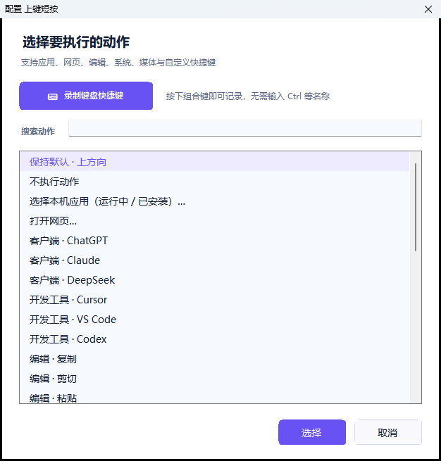
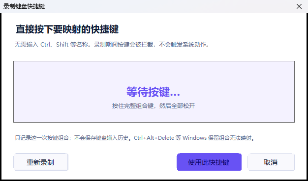
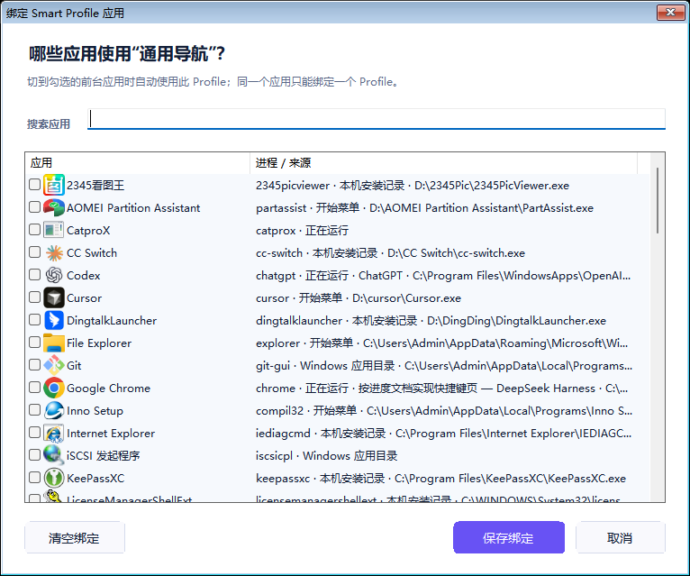

# 言灵 · Vibe Flow Remote V1.5.0 使用教程

这份教程面向第一次使用蓝牙语音遥控器的 Windows 用户。完成一次设置后，日常操作只有一句话：**单击目标输入框，按住录音键说话，松开结束，检查文字后按确认键发送。**

## 先下载正确文件

| 文件 | 用途 | 下载 |
| --- | --- | --- |
| **VibeFlow-Setup.exe** | **推荐普通用户安装** | [**直接下载**](https://github.com/richlearntodo-debug/vibe-flow/releases/download/v1.5.0/VibeFlow-Setup.exe) |
| Vibe-Flow-Windows-x64.zip | 免安装版，完整解压后使用 | [直接下载](https://github.com/richlearntodo-debug/vibe-flow/releases/download/v1.5.0/Vibe-Flow-Windows-x64.zip) |
| SHA256SUMS.txt | 校验安装包和 ZIP | [查看校验](https://github.com/richlearntodo-debug/vibe-flow/releases/download/v1.5.0/SHA256SUMS.txt) |

不要下载 GitHub 自动生成的 `Source code (zip)`，那是源码。当前安装包没有商业代码签名，Windows 首次运行可能显示 SmartScreen；请确认下载地址属于本仓库，并核对 SHA-256 后再选择“仍要运行”。

## 用户社区

加入社群可获得：

- 新手配置与 VB-CABLE 排错答疑；
- 不同遥控器、蓝牙适配器和语音工具的兼容经验；
- 新版本测试通知与功能建议反馈；
- Vibe Coding 快捷键、Profiles 和工作流分享。

<p align="center">
  
</p>

遇到问题时，请先在“自检”页导出诊断包，再扫码进入社群反馈。诊断日志不会包含录音或转译文字。

[先查看 V1.5 完整功能看板](FEATURES_ZH.md)

## 准备清单

- Windows 10 或 Windows 11，64 位；
- 小米 RC003 / MI RC 蓝牙语音遥控器；
- 可用的 Bluetooth LE 适配器；
- 一个支持全局快捷键的语音工具；
- VB-CABLE 虚拟音频驱动，首次向导可以引导安装。

支持的语音工具包括微信输入法、Typeless、豆包输入法、Windows 语音输入和其他自定义工具。第三方工具不包含在安装包中，其账号、网络、识别质量和数据规则由对应软件负责。

## 工作方式

```text
遥控器声音 -> Bluetooth ATVV -> 言灵
  -> CABLE Input -> CABLE Output
  -> 语音工具 -> 当前聚焦的文本输入框
```

言灵只传递本地音频并执行遥控器动作：不做语音识别，不读取转译文字，不保存普通录音，也不通过剪贴板回填文字。

## 首次设置：完成 5 项任务

向导会保存进度。安装 VB-CABLE 需要重启时，重新登录后会回到上次任务。

### 任务 1：确认设备与用法


确认固定流程：

1. 单击需要输入文字的文本框；
2. 按住录音键开始收音；
3. 持续说话，当前 RC003 单段约 60 秒；
4. 松开录音键结束；
5. 检查转译文字，再按中间确认键发送。

### 任务 2：连接并测试遥控器


1. 点击“打开蓝牙设置”；
2. 在 Windows 中添加 `MI RC` / RC003；
3. 按一次方向键唤醒遥控器；
4. 返回言灵并重新检测；
5. 页面必须显示收到真实 RC003 设备事件。

“已配对”不等于完整链路可用。真实按键、麦克风和音频通道还需要继续验证。

### 任务 3：准备本地音频通道


页面应同时检测到：

- `CABLE Input`：言灵写入遥控器声音的播放端；
- `CABLE Output`：语音工具读取声音的录音端；
- RC003 麦克风服务：遥控器已经提供真实音频。

如果未安装 VB-CABLE：

1. 点击“安装官方 VB-CABLE”；
2. 确认 Windows 管理员权限；
3. 按安装程序完成安装；
4. 如果系统要求重启，直接重启；
5. 返回向导后点击“重新检测”。

VB-CABLE 只在本机传递声音。言灵不会把 VB-CABLE 安装文件打包进应用，也不会静默安装驱动。

### 任务 4：选择工具并完成听写


先选择语音工具，再确保言灵和工具中的快捷键完全一致：

| 工具 | 推荐起点 | 触发方式 |
| --- | --- | --- |
| 微信输入法 | `Ctrl + Win` | 单击切换，默认稳定档案 |
| Typeless | 常见为 `Right Alt` | 以客户端当前设置为准 |
| 豆包输入法 | 客户端全局语音快捷键 | 两边逐键核对 |
| Windows 语音输入 | `Win + H` | 系统自带兼容选项 |
| 其他工具 | 工具自己的全局快捷键 | 必须支持全局开始 / 结束 |

真实测试：

1. 单击向导中的测试文本框，让插入光标出现；
2. 按住录音键并说：“测试麦克风，一二三四五六，期待效果。”；
3. 松开录音键；
4. 等待语音工具把文字直接写进测试框；
5. 点击“检查测试结果”。

只把鼠标停在输入框上不够，必须单击并让输入框获得焦点。

### 任务 5：开机即用


建议开启“随 Windows 启动”和“启动后隐藏到托盘”。以后登录 Windows 后，言灵会在后台等待蓝牙和遥控器恢复，不需要每次重新选择麦克风或语音工具。

## 日常听写


1. 单击 ChatGPT、Codex、Cursor、VS Code、浏览器或其他应用的输入框；
2. 按住遥控器录音键；
3. 首页显示真实“正在收音”状态后自然说话；
4. 松开录音键；
5. 等待语音工具完成转译；
6. 检查文字，按中间确认键发送。

当前稳定模式遵循 RC003 的物理按键周期，单段约 60 秒。达到硬件边界时会结束，不会自动创建第二个麦克风会话。V1.5 没有加入长录音续接。

## 遥控器按键

| 按键 | 默认动作 | 配置能力 |
| --- | --- | --- |
| 录音键 | 按住收音，松开结束 | 固定，不参与自定义 |
| 上 / 下 / 左 / 右 | 标准方向 | 单击可自定义 |
| 中间确认键 | `Enter` | 单击可自定义 |
| Home | 显示桌面 | 短按 / 长按可分别配置 |
| TV | 持久任务视图 | 单击可自定义 |
| 功能键 | 短按复制、长按粘贴 | 短按 / 长按可分别配置 |


开机、返回和独立音量键没有稳定的 Windows 事件，当前版本不提供配置入口。界面里没有出现的实体键，不应假设可映射。

## 配置一个动作

1. 打开“快捷键”；
2. 在遥控器示意图两侧选择一个可配置按键；
3. 选择短按或长按动作；
4. 从“应用与网页、编辑、系统、媒体”中选择；
5. 保存后先点击测试按钮；
6. 再用实体遥控器操作，并在首页查看真实执行回执。



支持：打开或切换本机 APP、打开 HTTPS 网页、区域截图、复制/粘贴、撤销/重做、系统动作、媒体控制和自定义键盘组合。

### 打开本机应用

选择器会汇总“正在运行”和“已安装”两类应用，并显示名称与图标。动作优先切换已有窗口，再尝试 EXE 或 Windows 开始菜单入口；找不到应用时才使用“浏览其他 EXE”。

### 直接录制键盘快捷键



1. 在动作选择器点击“录制键盘快捷键”；
2. 在实体键盘按住完整组合，例如 `Ctrl + Shift + P`；
3. 全部松开；
4. 核对界面显示的组合；
5. 点击“使用此快捷键”；
6. 等待“已保存并生效”的反馈。

录制期间按键会被临时拦截，避免误触发前台应用。只保存最终组合，不保存按键历史或输入文字。未知键、多个主键和 `Ctrl + Alt + Delete` 会被拒绝。

## 使用 Profiles

V1.5 内置：

- 通用导航；
- Vibe Coding；
- 浏览器 AI；
- Terminal Agent。

可以手动切换、新建、重命名、删除、导入和导出 Profile。Profile 只保存快捷动作，不包含语音工具、VB-CABLE、增益或其他录音参数。

### Smart Profiles（可选）

Smart Profiles 默认关闭。原有手动切换最简单、最稳定；只有确实需要按应用自动切换时再开启。



1. 在“快捷键”页开启“智能切换”；
2. 选择一个 Profile，点击“绑定应用”；
3. 勾选使用这个 Profile 的应用并保存；
4. 为浏览器、编辑器和终端分别配置；
5. 指定没有匹配应用时使用的回退 Profile；
6. 切换前台应用，在首页确认实际生效的 Profile；
7. 临时不希望自动切换时点击“锁定当前”。

同一个进程只能属于一个 Profile。自动切换不读取窗口标题或文字，不重启录音组件，也不修改语音参数。

## 白天与夜间模式


在“设置”页选择白天、夜间或跟随 Windows。主题立即生效，不会重启蓝牙、Bridge 或 Capture。默认使用白天模式。

## 一键自检


自检覆盖 10 项：组件、蓝牙、遥控器、按键监听、真实音频、VB-CABLE、稳定语音参数、语音工具、自启动和完整会话。

每一项都会显示：

- 正确状态；
- 当前实际状态；
- 出错原因；
- 下一步修复按钮。

修复 Windows 设置后返回言灵，直接重新检测，不需要从头运行首次教程。需要反馈时点击“导出诊断”；日志会隐藏用户路径、设备身份、URL 和应用目标，不包含录音或转译文字。

## 常见问题

| 现象 | 先检查 | 处理方式 |
| --- | --- | --- |
| 按录音键没有反应 | RC003 是否连接、是否只有一个言灵实例 | 按方向键唤醒遥控器，运行自检并重建连接 |
| 有收音但没有文字 | 语音工具麦克风、输入框焦点 | 工具输入设为 `CABLE Output`，单击目标输入框后重试 |
| 松开后才开始录音 | 是否运行了旧便携版 | 退出全部 Vibe Flow / VibeMic，再只启动 V1.5 |
| 出现第二个麦克风 | 是否同时运行多个版本 | 托盘退出所有实例，重新启动安装版并运行自检 |
| 快捷动作与界面不一致 | Profile 与首页执行回执 | 关闭 Smart Profiles 验证手动模式，再检查应用绑定 |
| APP 找不到 | “正在运行 / 已安装”标签 | 重新打开选择器；仍找不到时使用“浏览其他 EXE” |
| 浏览器左键不返回 | 当前 Profile 与动作 | 切到 Browser AI，确认动作显示“返回上一页” |
| 普通键盘被影响 | 是否运行旧实验版 | 只保留 V1.5；导出诊断并检查来源保护状态 |
| Windows 阻止安装 | SmartScreen / 文件来源 | 仅从本仓库下载，核对 SHA-256 后选择“仍要运行” |

## 更新或回退

- 覆盖安装 V1.5 会迁移现有配置，并保留备份；
- 更新前从系统托盘退出旧实例更稳妥；
- 不要同时运行安装版和免安装版；
- [版本下载页](VERSION_ARCHIVE_ZH.md)保存每个公开版本的固定入口；
- V1.4 是不完整预览归档，普通用户不要用它替代 V1.5。

## 隐私说明

- 音频通过本机蓝牙与 VB-CABLE 传输；
- 言灵不保存日常录音和转译文字；
- 第三方语音工具如何处理音频，遵循其自己的隐私政策；
- 诊断音频只在用户明确确认后采集下一段，并限制时长；
- Profile 导出不包含语音参数或转译内容。
