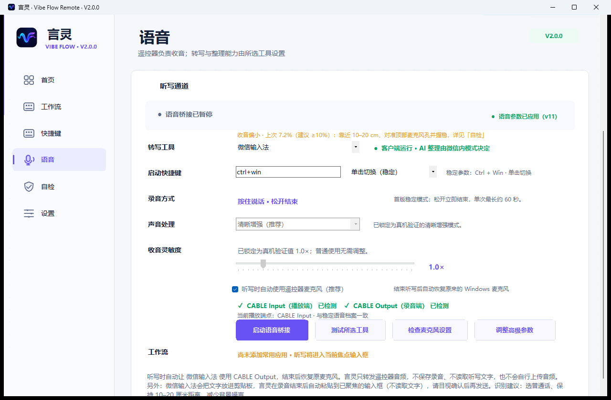
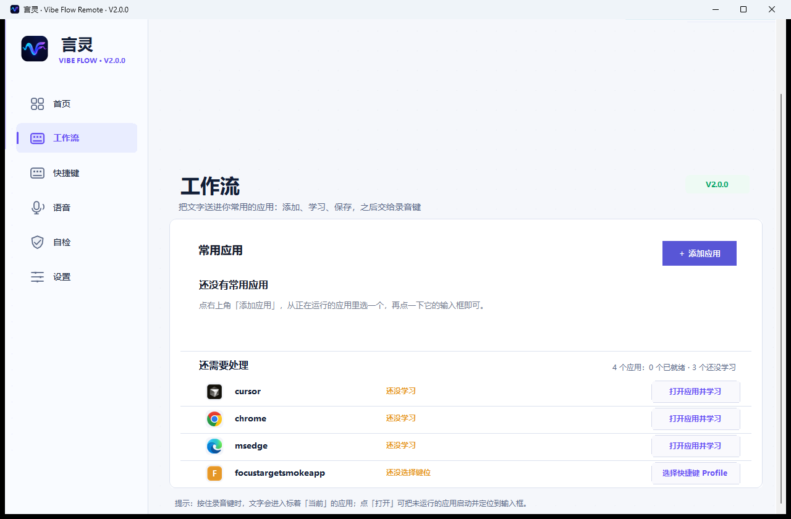

# 言灵 · Vibe Flow Remote V2.0 图文使用教程

> 适用版本：`v2.0.0-candidate.2`。本教程描述当前公开候选版的实际页面和边界。
>
> V2.0 不是代码编辑器，也不是 AI 客户端。它负责让 RC003、语音工具和你当前的输入框协同工作。录音文字由第三方语音工具产生，Vibe Flow 不读取、保存或上传普通转写文字，也不会替你按发送。

## 先看结果：一次完整的语音输入

```text
打开目标应用
  -> 手动点击输入框，或完成 Smart Focus 锁定
  -> 按住 RC003 录音键说话
  -> 松开录音键结束
  -> 等待语音工具处理
  -> 目视检查文字
  -> 按确认键发送一次
```

录音键始终是“按住开始、松开结束”。松开只结束录音，不会自动按 Enter，也不会自动发送 AI 消息。


## 目录

1. [下载、校验与安装](#下载校验与安装)
2. [首次设置五项任务](#首次设置五项任务)
3. [VB-CABLE 与音频通道](#vb-cable与音频通道)
4. [选择语音工具](#选择语音工具)
5. [Smart Focus 目标输入框](#smart-focus目标输入框)
6. [日常语音输入闭环](#日常语音输入闭环)
7. [快捷键与 Profiles](#快捷键与profiles)
8. [Live HUD 与 Context Deck](#live-hud与context-deck)
9. [自检与故障排查](#自检与故障排查)
10. [设置、升级与恢复](#设置升级与恢复)
11. [隐私和稳定边界](#隐私和稳定边界)
12. [进一步帮助](#进一步帮助)

## 下载、校验与安装

### 1. 下载正确的文件

V2.0 候选版的三个固定入口如下：

- [VibeFlow-Setup.exe 安装版](https://github.com/richlearntodo-debug/vibe-flow/releases/download/v2.0.0-candidate.2/VibeFlow-Setup.exe)
- [Vibe-Flow-Windows-x64.zip 便携版](https://github.com/richlearntodo-debug/vibe-flow/releases/download/v2.0.0-candidate.2/Vibe-Flow-Windows-x64.zip)
- [SHA256SUMS.txt 校验清单](https://github.com/richlearntodo-debug/vibe-flow/releases/download/v2.0.0-candidate.2/SHA256SUMS.txt)

不要下载 GitHub 自动生成的 `Source code (zip/tar.gz)`，那是源码快照，不是可运行程序。

### 2. 校验下载完整性

把三个文件放在同一目录，在 PowerShell 中运行：

```powershell
Get-FileHash .\VibeFlow-Setup.exe -Algorithm SHA256
Get-FileHash .\Vibe-Flow-Windows-x64.zip -Algorithm SHA256
Get-Content .\SHA256SUMS.txt
```

当前候选版的固定哈希：

```text
B08E50B0F3BA39F14E3C8B6523B2ACEB852D86BFE682FB29CECFC46A0CEF032B  VibeFlow-Setup.exe
B8AEBCDA1D0239658E4C35B03FA9EB58B58CCB267A9B49465CAE11FA720565FF  Vibe-Flow-Windows-x64.zip
```

### 3. 安装版和便携版的区别

- **安装版**：推荐日常用户。支持开始菜单、覆盖升级、标准卸载和安装目录管理。
- **便携版**：完整解压后运行 `VibeFlow.exe`。不要直接在压缩包内运行，也不要只复制单个 EXE。

当前构建没有商业 Authenticode 签名，Windows 可能显示未知发布者或 SmartScreen 提示。请核对下载地址和 SHA-256，不要关闭系统安全功能。

## 首次设置五项任务

首次启动会引导完成五项任务。每一步都可以稍后处理，进度会保留；点击按钮本身不会自动变成“已完成”，只有检测或用户明确确认后才会改变状态。

### 任务 1：了解设备、流程和隐私


你需要确认这条流程：

1. 按住录音键开始收音。
2. 松开录音键结束收音。
3. 等待语音工具处理。
4. 目视检查文字。
5. 按确认键手动发送。

这里还会说明：RC003 单段约 60 秒、录音键不可改成点击切换、Vibe Flow 不做语音识别，也不保存普通录音和转写文字。

### 任务 2：连接并验证遥控器


1. 打开 Windows 蓝牙设置。
2. 配对 `MI RC` / `RC003`。
3. 返回 Vibe Flow，点击“重新检测”。
4. 按一次方向键，确认检测到的是遥控器事件，而不是普通键盘输入。

“已配对”只代表蓝牙配对完成，不代表按键和麦克风链路可用。没有检测到方向键时，不要继续把问题归因于语音工具。

### 任务 3：准备本地音频通道


完整 RC003 麦克风链路需要 VB-CABLE：

```text
RC003 麦克风 -> Bluetooth ATVV -> Vibe Flow -> CABLE Input
                                                       |
                                语音工具麦克风 <- CABLE Output
```

在任务页确认：

- 播放/回放端：`CABLE Input`；
- 语音工具的麦克风输入：`CABLE Output`；
- Windows 没有把端点静音，输入级别不是 0%。

官方驱动安装需要用户确认和可能的管理员权限。安装器退出不等于音频链路已经可用，必须返回 Vibe Flow 重新检测并完成真实测试。

### 任务 4：选择工具并完成一次真实听写


选择一个语音工具，并按工具自己的说明设置快捷键和触发方式。Vibe Flow 两边的快捷键必须完全一致。


在明确的测试输入框中：

1. 点击输入框，确认出现插入光标。
2. 按住 RC003 录音键，说一句短句。
3. 松开，等待工具处理。
4. 目视确认文字出现。
5. 只有看到文字后，才点击“完成本步”。

### 任务 5：完成个性化


这里可以选择：

- 是否开机启动后台服务；
- 是否最小化到托盘；
- 是否启用 Smart Profiles（现有用户默认关闭）；
- 是否稍后配置 Smart Focus。


没完成的项目会明确显示影响，不会伪装成全部通过。之后可在“设置”里重新打开首次设置。

## VB-CABLE 与音频通道



### 正确方向

| 位置 | 应选择 |
| --- | --- |
| Vibe Flow 播放端 | `CABLE Input` |
| 语音工具的麦克风输入 | `CABLE Output` |
| Windows 默认麦克风 | 不要为了测试随意改动全局默认设备 |

如果“自检”显示未安装、已安装但不可用或端点缺失，按页面提供的修复入口处理。不要重复安装已经存在的驱动，也不要在没有确认影响的情况下修改系统默认音频设备。

### 通过收音电平判断问题

语音页会显示最近一次真实会话的实测电平：

- 低于 10%：靠近遥控器、对准顶部麦克风孔、握稳，并检查 `CABLE Output` 输入级别；
- 10% 到 30%：通常是较舒适的识别区间；
- 没有记录：尚未完成一次真实收音；
- 没有收到音频：先处理蓝牙、唤醒和 VB-CABLE，不要先修改录音增益。

冻结参数 `gain=1.0`、`autoLevel=true`、`speech` 和 `drainMs=180` 不作为普通用户调节项。

## 选择语音工具

### Windows 语音输入（Win+H）

这是优先排查“文字要直接出现在输入框”时的工具。它通常直接写入当前可编辑控件，但仍受 Windows 语音输入权限、网络和焦点影响。

排查顺序：

1. 手动点击目标输入框。
2. 确认 Windows 语音输入可以被 `Win+H` 唤起。
3. 先用键盘测试一次，再用 RC003 测试。
4. 如果键盘能写、RC003 不能写，查看桥接和录音自检，而不是重复学习输入框。

### Typeless

按 Typeless 客户端要求配置快捷键和麦克风。Vibe Flow 只负责派发已配置的触发动作和维持录音状态，不读取 Typeless 的转写内容。

### 微信输入法

微信输入法是第三方工具。部分版本会先把识别结果放入剪贴板，而不是直接向当前控件注入文字。Vibe Flow 不读取剪贴板文字，也不能保证它在所有 ChatGPT、浏览器或提权窗口中直写。

当前候选在收到真实完成回执且目标仍验证为可写控件时，可能派发一次 `Ctrl+V` 作为工具兼容路径；这只代表“粘贴动作已派发”，不代表 AI 已收到或消息已发送。如果文字仍停留在剪贴板：

1. 不要连续按录音键重试。
2. 点击目标输入框，确认光标出现。
3. 手动按 `Ctrl+V`，检查文字是否正确。
4. 需要完全绕开剪贴板时，切换 Windows 语音输入并重新测试。

### 不建议把豆包输入法当作自动化提供方

V2.0 不再把豆包输入法列为自动配置项。若必须使用，只能按“其他语音工具”手动配置，并自行确认实际行为。

## Smart Focus 目标输入框



Smart Focus 的作用是“锁定并验证输入框”，不是读取网页内容，也不是代替你点击任意坐标。

### 学习一个目标

1. 打开“工作流”页。
2. 点击“添加应用”，选择 ChatGPT、浏览器、编辑器、终端或其他目标程序。
3. 点击“学习目标输入框”。Vibe Flow 会暂时隐藏主窗口并显示简短提示。
4. 切到目标应用，点击真正要输入文字的控件。
5. 等待提示自动捕获稳定的可编辑 UI Automation 元素。
6. 查看识别结果，点击“立即测试”。
7. 测试成功后点击“保存”并“设为当前”。

保存的描述符只包含进程名、AutomationId、控件类型、类名和稳定父级结构指纹；不保存输入框当前文字、窗口标题正文或屏幕坐标。

### 使用已学习目标

1. 确认应用状态为“已验证”。
2. 点击“设为当前”或首页的“锁定目标输入框”。
3. 看到 HUD 或页面提示“目标已锁定”后，再按住录音键。

如果你已经手动点击了一个有效输入框，手动焦点优先；Smart Focus 不应在录音过程中抢走焦点。目标失效、应用关闭或当前进程不匹配时，Vibe Flow 会停止后续聚焦动作并显示修复入口，不会静默向未知位置发送内容。

### 常见状态

| 状态 | 含义 | 处理方式 |
| --- | --- | --- |
| 还没学习 | 只有应用，没有输入控件描述符 | 重新学习 |
| 已学习未验证 | 保存过描述符，但未完成真实测试 | 点击“立即测试” |
| 已验证 | 目标可聚焦且可写 | 可以设为当前 |
| 目标已失效 | 应用 UI 或进程发生变化 | 重新学习，不要盲目重试录音 |

## 日常语音输入闭环

### 路径 A：手动点击输入框

1. 打开 ChatGPT 或其他目标应用。
2. 点击消息输入框，确认插入光标仍在其中。
3. 不打开会抢焦点的弹窗、HUD 或设置页。
4. 按住 RC003 录音键并说话。
5. 松开录音键，等待语音工具处理。
6. 检查完整文字、标点和位置。
7. 按确认键发送一次。

### 路径 B：Smart Focus

1. 在工作流页把目标状态设为“已验证”。
2. 点击“锁定目标输入框”。
3. 等待“目标已锁定”真实反馈。
4. 按住录音键说话，松开。
5. 只在看到文字后按确认键。

两条路径都不会在松开录音键时自动发送。若文字没有出现，先处理目标和语音工具，再重新录音；不要连续触发多个会话制造重复结果。

## 快捷键与 Profiles


快捷键页保留 V1.5 的 Profile 和映射，同时把新动作放进同一套可见配置中。

### 录音键是固定键

录音键只走稳定的按住/松开录音链路，不参与普通映射、短按/长按/双击、Smart Focus、Deck 或其他动作。

### 可配置键

- 上、下、左、右：默认方向键，可绑定已支持动作；
- 确认键：默认 `Enter`，用于用户检查后发送；
- Home：短按默认显示桌面，长按可选；
- TV：默认任务视图，可配置；
- 功能键：短按复制、长按粘贴，可分别修改；
- 电源键：可以配置，但其扫描码与蓝牙重连后的麦克风键形态存在冲突，重视录音可靠性时请保持“不执行动作”。返回键和独立音量键在当前 RC003 / Windows 组合中没有稳定事件，不提供映射。

### 三层手势

每个可配置键最多有：短按、长按、双击。长按约 650 ms；双击窗口跟随 Windows 设置，下限 500 ms。未设置的层会显示“跟随”关系，不会假装存在独立动作。

如果一个键配置了双击，它的短按可能要等到松手后才能判定。要恢复 V1.5 的按下即执行行为，清空该键的双击动作。


### 录制键盘组合

1. 打开一个 Profile。
2. 选择实体键和手势层。
3. 点击“录制键盘快捷键”。
4. 在录制窗口中按真实键盘组合。
5. 松开后检查显示的组合，再保存。

录制窗口只在自身打开期间临时拦截普通键盘输入，完成、取消或异常退出后必须恢复。保存后等待 Bridge ACK，再把“已生效”当作真实状态。

## Live HUD 与 Context Deck


### Live HUD

Live HUD 是不抢焦点的状态浮层，显示：

- 设备连接和语音桥接状态；
- 当前 Profile 和 Smart Focus 目标；
- 录音中、录音已结束、等待语音工具处理；
- 最近一次实体按键动作和真实结果；
- 警告、错误、取消和修复入口。

它不会把“录音已结束”写成“转写完成”，也不会把“粘贴动作已派发”写成“AI 已收到”。录音期间不能打开会抢焦点的设置窗口。

### Context Deck

Context Deck 是只读说明面板，显示当前应用、Profile、目标输入框、按键实际动作、最近结果和设备状态。它不建立第二套 Raw Input 导航，不会让一次遥控器输入执行两次。

## 自检与故障排查


打开“自检”后，从第一个警告或错误开始处理。每一项都应包含：当前状态、证据、影响、建议操作、重新检测入口和错误码。

如果看到 `VOICE-RUNTIME-INCOMPLETE`，表示语音运行时只完成了部分初始化；本次不会把录音结束误报为转写完成，也不会自动发送。先按页面提示检查语音工具快捷键、`CABLE Input` / `CABLE Output` 和遥控器连接，再点击“重新检测”；在检测通过前请手动确认输入框仍有光标。

### 推荐排查顺序

1. **程序组件**：确认 `VibeFlow.exe`、`VoxDeckInputBridge.exe`、冻结 Capture 和 NAudio 文件齐全。
2. **蓝牙与遥控器**：确认设备连接，并用方向键测试真实事件。
3. **音频端点**：确认 `CABLE Input` / `CABLE Output` 存在且未静音。
4. **语音工具**：确认快捷键、触发方式和麦克风输入端一致。
5. **目标输入框**：确认手动光标或 Smart Focus 目标仍在正确进程中。
6. **录音状态**：确认按住开始、松开结束，没有重复会话或卡住的录音状态。
7. **Bridge ACK**：保存按键后确认桥接服务已经确认 revision。
8. **重新测试**：只改一个因素，再完成一次短句测试。

### 现象与处理

| 现象 | 先检查 | 不要做什么 |
| --- | --- | --- |
| 文字进了剪贴板 | 语音工具是否为微信输入法；目标是否仍有光标；切换 Windows 语音输入对照 | 不要让 Vibe Flow 读取剪贴板文字回填，不要连续按录音键 |
| 完全没有文字 | 语音工具是否唤起、`CABLE Output` 是否可用、最近收音电平 | 不要先修改冻结增益 |
| F5 刷新了网页 | 自检中的 RC003 设备级过滤器状态、遥控器是否在线 | 不要用全局键盘 Hook 或修改 Capture 绕过 |
| Smart Focus 失效 | 目标是否“已验证”、进程是否关闭、输入控件是否仍存在 | 不要使用固定坐标静默点击 |
| 快捷键不生效 | 当前 Profile、动作层、Bridge ACK、是否有两个实例 | 不要重复保存覆盖原 Profile |
| VB-CABLE 缺失 | 自检中的驱动状态和真实端点列表 | 不要反复安装或随意改默认音频设备 |
| 文字出现后被替换 | 检查微信输入法是否重复唤起或开启 AI 整理 | 不要把第三方工具状态误报成 Vibe Flow 已发送 |
| 页面字被裁切 | 记录缩放比例、窗口尺寸，在自检导出诊断 | 不要仅凭源码推断 DPI 通过 |

### 导出诊断

反馈问题时请附：版本号、错误码、复现步骤和去敏诊断日志。日志不应包含普通录音、转写文字、截图内容、完整窗口标题、蓝牙地址或不必要的完整路径。

## 设置、升级与恢复


设置页分为：外观、后台与托盘、HUD 与通知、隐私和本地数据、更新、诊断与重置。

### 升级 V1.5

正常覆盖升级应保留：

- 语音工具、快捷键和触发方式；
- Profiles、Smart Profiles 开关和回退 Profile；
- 主题、开机启动和托盘设置；
- 冻结录音参数。

升级后先打开“快捷键”和“语音”页核对，再运行“自检”。V2.0 不会自动创建新的按键绑定，也不会自动打开 Smart Profiles。

### 重启、断连和恢复

- 蓝牙断开时，先等待设备重新连接，再运行自检；不要手动启动第二个 Bridge。
- Windows 睡眠/唤醒后，重新检测遥控器和音频端点，再完成一次短句测试。
- 如果升级中断，重新启动安装器；不要删除用户数据目录来“修复”配置。
- 卸载时不要擅自删除其他软件可能使用的 VB-CABLE。需要移除共享驱动时，应在 Windows 或官方驱动工具中单独处理。

## 隐私和稳定边界

- 不上传截图、录音或转写文字。
- 不读取网页正文或用户输入框中的文字。
- 不自动发送 AI 消息，不自动接受或拒绝 AI 代码改动。
- 不执行任意 Shell、PowerShell、CMD 命令。
- 不新增第二套录音状态机，不使用 MIC_EXTEND，不把按住录音改成点击切换。
- 录音键、Raw Input、键盘 Hook、设备过滤和 Capture 属于稳定边界，UI 功能不能改变它们的时序。

## 进一步帮助

- [V2.0 FAQ 与故障排查](V2_0_FAQ_ZH.md)
- [V2.0 更新说明](V2_0_RELEASE_NOTES_ZH.md)
- [V2.0 已知限制](V2_0_KNOWN_LIMITATIONS_ZH.md)
- [V2.0 真机测试矩阵](V2_0_HARDWARE_TEST_MATRIX_ZH.md)
- [V1.5 图文教程](V1_5_USER_GUIDE_ZH.md)
- [版本下载归档](VERSION_ARCHIVE_ZH.md)

如果问题仍存在，请提供：Vibe Flow 版本、Windows 版本、语音工具、是否安装 VB-CABLE、目标应用、当前自检错误码以及“按键后发生了什么”的最短复现步骤。不要上传私人录音、转写文字或包含个人信息的截图。
